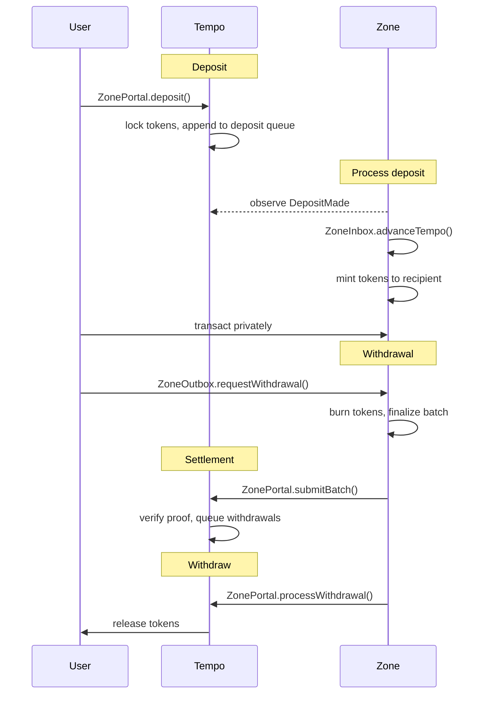
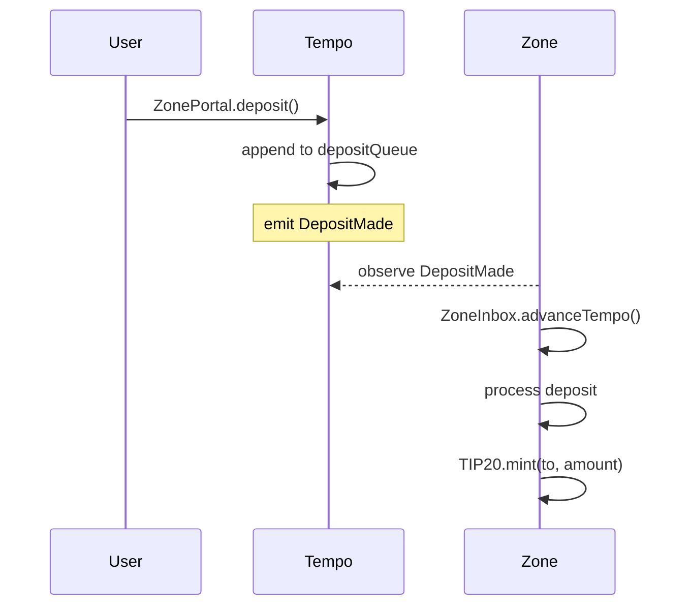
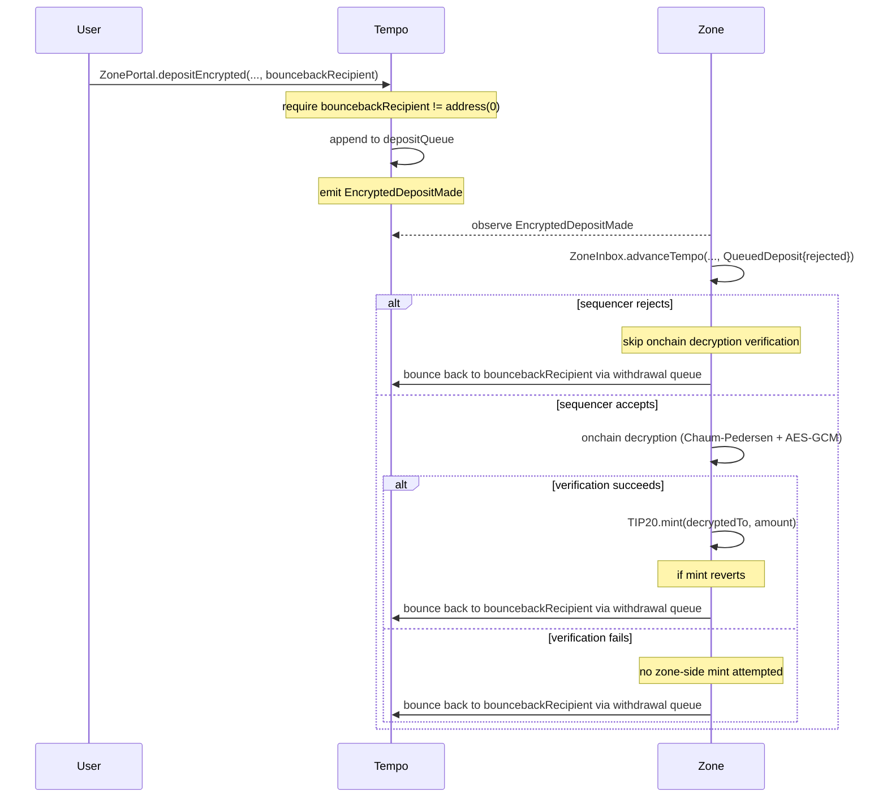
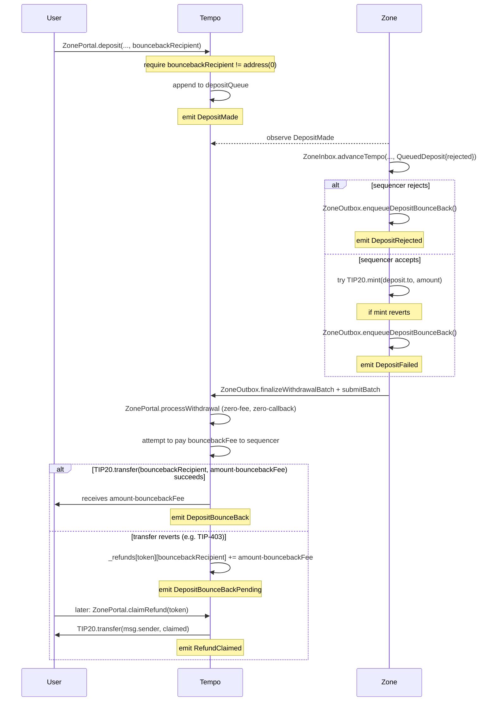
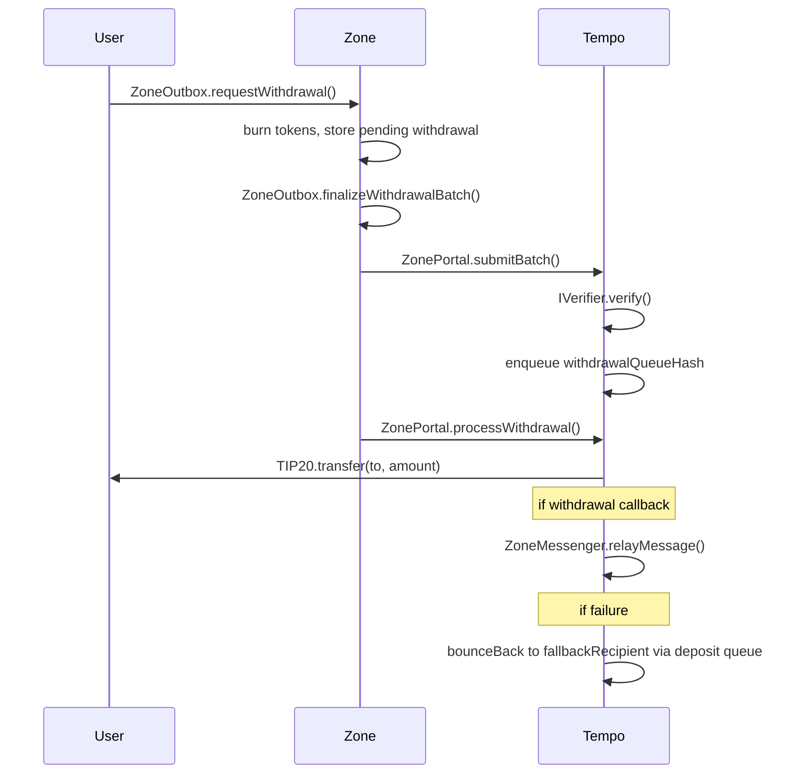
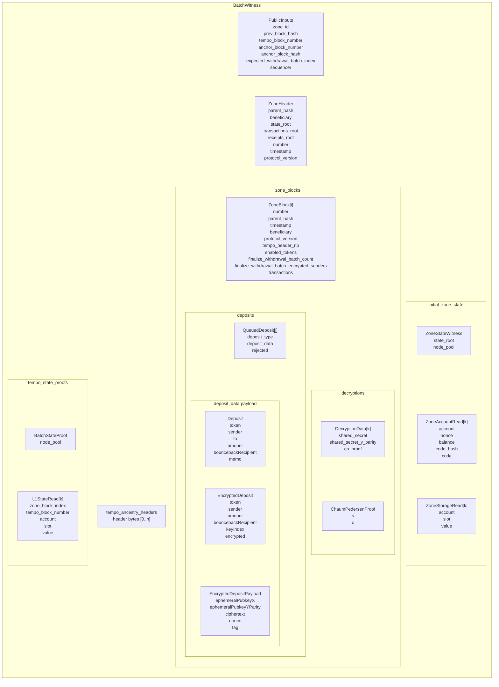

# Tempo Zones

**Table of Contents**

- [Abstract](#abstract)
- [Specification](#specification)
  - [Terminology](#terminology)
  - [System Overview](#system-overview)
  - [Access Control](#access-control)
    - [Roles](#roles)
    - [Permission Matrix](#permission-matrix)
  - [Zone Deployment](#zone-deployment)
    - [Chain ID](#chain-id)
    - [Tempo Contracts](#tempo-contracts)
    - [Zone Predeploys](#zone-predeploys)
    - [Zone Token Model](#zone-token-model)
  - [Sequencer Operations](#sequencer-operations)
    - [Token Management](#token-management)
    - [Gas Rate Configuration](#gas-rate-configuration)
    - [Encryption Key Management](#encryption-key-management)
    - [Sequencer Transfer](#sequencer-transfer)
    - [Admin Transfer](#admin-transfer)
  - [Deposits](#deposits)
    - [Regular Deposits](#regular-deposits)
    - [Deposit Fees](#deposit-fees)
    - [Deposit Queue](#deposit-queue)
    - [Encrypted Deposits](#encrypted-deposits)
    - [Onchain Decryption Verification](#onchain-decryption-verification)
    - [Deposit Failures and Bounce-Back](#deposit-failures-and-bounce-back)
  - [Withdrawals](#withdrawals)
    - [Withdrawal Request](#withdrawal-request)
    - [Withdrawal Fees](#withdrawal-fees)
    - [Withdrawal Batching](#withdrawal-batching)
    - [Withdrawal Queue](#withdrawal-queue)
    - [Withdrawal Processing](#withdrawal-processing)
    - [Withdrawal Callbacks](#withdrawal-callbacks)
    - [Withdrawal Failures and Bounce-Back](#withdrawal-failures-and-bounce-back)
    - [Authenticated Withdrawals](#authenticated-withdrawals)
    - [Zone-to-Zone Transfers](#zone-to-zone-transfers)
  - [Zone Execution](#zone-execution)
    - [Fee Accounting](#fee-accounting)
    - [Block Structure](#block-structure)
    - [Block Header Format](#block-header-format)
    - [Privacy Modifications](#privacy-modifications)
  - [Tempo State Reads](#tempo-state-reads)
    - [TempoState Predeploy](#tempostate-predeploy)
    - [Tempo Follower Mode](#tempo-follower-mode)
    - [Header Finalization](#header-finalization)
    - [Storage Reads](#storage-reads)
    - [Staleness and Finality](#staleness-and-finality)
  - [TIP-403 Policies](#tip-403-policies)
    - [Policy Enforcement on Zones](#policy-enforcement-on-zones)
    - [Policy Inheritance](#policy-inheritance)
  - [Private RPC](#private-rpc)
    - [Authorization Tokens](#authorization-tokens)
    - [Signature Types](#signature-types)
    - [Method Access Control](#method-access-control)
    - [Block Responses](#block-responses)
    - [Event Filtering](#event-filtering)
    - [WebSocket Subscriptions](#websocket-subscriptions)
    - [Zone-Specific Methods](#zone-specific-methods)
    - [Error Codes](#error-codes)
  - [Proving System](#proving-system)
    - [State Transition Function](#state-transition-function)
    - [Witness Structure](#witness-structure)
    - [Input Schematic](#input-schematic)
    - [Detailed Input Definitions](#detailed-input-definitions)
    - [Shared Trie Proof Format](#shared-trie-proof-format)
    - [Batch Output](#batch-output)
    - [Block Execution](#block-execution-stateless-prover-execution-function)
    - [Tempo State Proofs](#tempo-state-proofs)
    - [Deployment Modes](#deployment-modes)
  - [Batch Submission](#batch-submission)
    - [submitBatch](#submitbatch)
    - [Verifier Interface](#verifier-interface)
    - [Anchor Block Validation](#anchor-block-validation)
    - [Proof Requirements](#proof-requirements)
  - [Zone Precompiles](#zone-precompiles)
    - [TIP-20 Token Precompile](#tip-20-token-precompile)
    - [Chaum-Pedersen Verify](#chaum-pedersen-verify)
    - [AES-GCM Decrypt](#aes-gcm-decrypt)
  - [Contracts and Interfaces](#contracts-and-interfaces)
    - [Common Types](#common-types)
    - [IZoneFactory](#izonefactory)
    - [IZonePortal](#izoneportal)
    - [IZoneMessenger](#izonemessenger)
    - [IWithdrawalReceiver](#iwithdrawalreceiver)
    - [ITempoState](#itempostate)
    - [IZoneInbox](#izoneinbox)
    - [IZoneOutbox](#izoneoutbox)
    - [IZoneConfig](#izoneconfig)
    - [TIP-403 Registry](#tip-403-registry)
  - [Network Upgrades and Hard Fork Activation](#network-upgrades-and-hard-fork-activation)

---

# Abstract

A Tempo Zone is a private execution environment anchored to Tempo. Inside a zone, balances, transfers, and transaction history are invisible to block explorers, indexers, and other users. Each zone is operated by a dedicated sequencer that is the sole block producer, settling back to Tempo through a proof-agnostic verification system.

Funds enter a zone through deposits on Tempo, where they are locked in the portal. The zone mints equivalent tokens, and users transact privately with balances and transaction history hidden behind authenticated RPC access and execution-level controls. When users withdraw, tokens are burned on the zone and released from the portal on Tempo. Proofs guarantee that the sequencer executed every transaction correctly and cannot forge state transitions. Withdrawals support optional callbacks, making them composable with Tempo contracts and enabling zone-to-zone transfers.

This document specifies the zone protocol: deployment, sequencer operations, deposits, execution, the private RPC interface, the proving system, batch submission, withdrawals, precompiles, contract interfaces, and the network upgrade process.

# Specification

## Terminology

| Term | Definition |
|------|------------|
| Tempo | The base chain that zones settle to. |
| Zone | A private execution environment anchored to Tempo. |
| Portal | The contract on Tempo that locks deposited tokens and finalizes withdrawals for a zone. |
| Batch | A sequencer-produced commitment covering one or more zone blocks, submitted to Tempo with a proof. |
| Admin | The privileged governance role for a zone. Cold/mission-critical key. Controls token enablement. See [Access Control](#access-control). |
| Sequencer | The privileged operational role for a zone. Hot/online key. Sole block producer; submits batches and processes withdrawals. See [Access Control](#access-control). |
| Enabled token | A TIP-20 token that the admin has activated for deposits and withdrawals on a zone. Enablement is permanent. |
| TIP-20 | Tempo's fungible token standard. |
| TIP-403 | Tempo's compliance registry. Issuers attach transfer policies (whitelists, blacklists) to TIP-20 tokens. |
| Predeploy | A system contract deployed at a fixed address on the zone at genesis. |

<br>

## System Overview

Each zone is operated by a **sequencer** that collects transactions, produces blocks, generates proofs, and submits batches to Tempo. A single registered address controls sequencer operations for each zone. Each zone also has a separate **admin** role that holds governance powers (enabling tokens, configuring deposit pause/resume); see [Access Control](#access-control). **Users** deposit TIP-20 tokens from Tempo into the zone, transact privately, and withdraw back to Tempo.

On the Tempo side, an onchain **verifier** contract validates that each batch was executed correctly. The verifier is abstracted behind a minimal interface (`IVerifier`) and is proof-agnostic. Any proving backend (ZK, TEE, or otherwise) can implement the interface. The portal does not care how the proof was produced.

On Tempo, each zone has a **portal** that locks deposited tokens. When a user deposits, the portal locks their tokens and appends the deposit to a queue. The sequencer observes the deposit, advances the zone's view of Tempo, and mints equivalent tokens on the zone.

Users transact on the zone privately. Balances, transfers, and transaction history are only visible to the account holder and the sequencer. The zone does not post transaction data, and data availability is entrusted to the sequencer. The sequencer has full visibility into zone activity. Privacy protects against public observers on Tempo, not against the sequencer.

Zones rely on the following trust assumptions: the verifier must be sound for state transition integrity, the sequencer is trusted for liveness and data availability, and there is no forced inclusion or permissionless exit mechanism.

When a user wants to exit, they request a withdrawal on the zone. Their tokens are burned on the zone side, and the withdrawal is added to a pending list. At the end of a batch, the sequencer finalizes all pending withdrawals into a hash chain and generates a proof covering the full batch of zone blocks. The sequencer submits this batch and proof to the portal on Tempo, which verifies the proof and queues the withdrawals. The sequencer then processes each withdrawal, releasing tokens from the portal to the recipient.



<br>

## Access Control

Each zone has two privileged roles registered on the [`ZonePortal`](#izoneportal): an **admin** and a **sequencer**. The roles are intentionally separated so that mission-critical governance powers can be held in a cold key (or multisig) while day-to-day block production runs from a hot operational key. The two roles MAY be held by the same address; the protocol does not enforce separation.

### Roles

**Admin.**

- Holds governance powers over the zone (token enablement, deposit pause/resume).
- Expected to be a cold key, multisig, or governance contract.
- Set at zone creation via [`IZoneFactory.createZone`](#izonefactory).
- Rotatable via a two-step transfer (see [Admin Transfer](#admin-transfer)), so a lost or compromised admin key can be moved to a new cold key or multisig.
- Cannot be renounced. 

**Sequencer.**

- Operates the zone: collects transactions, produces blocks, advances Tempo, processes deposits and withdrawals, and submits batches with proofs.
- Expected to be an online operational key.
- Rotatable via a two-step transfer. (see [Sequencer Transfer](#sequencer-transfer))
- Cannot be renounced.
- Set at zone creation via [`IZoneFactory.createZone`](#izonefactory).
- Holds the encryption private key used to decrypt [encrypted deposits](#encrypted-deposits).

A zone MAY be deployed with `admin == sequencer`. In that case the same address holds both roles, but the protocol still treats each privileged call as belonging to its role.

### Permission Matrix

The following table lists every privileged action and the role authorized to invoke it.

| Action | Contract | Authorized caller |
|---|---|---|
| `enableToken(token)` | [`ZonePortal`](#izoneportal) | **admin** |
| `pauseDeposits(token)` | [`ZonePortal`](#izoneportal) | **admin** |
| `resumeDeposits(token)` | [`ZonePortal`](#izoneportal) | **admin** |
| `transferAdmin(newAdmin)` | [`ZonePortal`](#izoneportal) | **admin** |
| `acceptAdmin()` | [`ZonePortal`](#izoneportal) | **pending admin** |
| `transferSequencer(newSequencer)` | [`ZonePortal`](#izoneportal) | **sequencer** |
| `acceptSequencer()` | [`ZonePortal`](#izoneportal) | **pending sequencer** |
| `setZoneGasRate(rate)` | [`ZonePortal`](#izoneportal) | **sequencer** |
| `setSequencerEncryptionKey(...)` | [`ZonePortal`](#izoneportal) | **sequencer** |
| `setRpcUrl(url)` | [`ZonePortal`](#izoneportal) | **sequencer** |
| `submitBatch(...)` | [`ZonePortal`](#izoneportal) | **sequencer** |
| `processWithdrawal(...)` | [`ZonePortal`](#izoneportal) | **sequencer** |
| `setTempoGasRate(rate)` | [`ZoneOutbox`](#izoneoutbox) (zone-side) | **sequencer** or zone system caller (`address(0)`) |
| `setMaxWithdrawalsPerBlock(limit)` | [`ZoneOutbox`](#izoneoutbox) (zone-side) | **sequencer** or zone system caller (`address(0)`) |
| `finalizeWithdrawalBatch(...)` | [`ZoneOutbox`](#izoneoutbox) (zone-side) | **sequencer** or zone system caller (`address(0)`) |
| Block production / `beneficiary` | zone | **sequencer** |

Rationale notes:

- **Token enablement and deposit pause/resume are admin-only** because they govern what the zone is and which deposit flows are open. A compromised sequencer hot key MUST NOT be able to enable arbitrary tokens or unilaterally re-open paused deposits.
- **Gas rates are sequencer-controlled** because the sequencer takes the economic risk on gas-price fluctuations and needs to react quickly to operational events without involving the cold key.
- **Encryption key management is sequencer-only** because the proof of possession requires the encryption private key.
- **Zone-side system calls** to `ZoneOutbox` may use `msg.sender == address(0)` so the block builder can inject protocol system transactions. Ordinary user transactions must come from the registered sequencer address for these calls.
- **`processWithdrawal` is sequencer-only** today; whether to make it permissionless once the proof has settled is tracked separately.

<br>

## Zone Deployment

A zone is created via `ZoneFactory.createZone(...)` on Tempo with the following parameters:

| Parameter | Description |
|-----------|-------------|
| `initialToken` | The first TIP-20 token to enable. The admin can enable additional tokens later. |
| `admin` | The address that holds the admin role for the zone (token enablement, deposit pause/resume). MUST NOT be the zero address. May be the same as `sequencer`. See [Access Control](#access-control). |
| `sequencer` | The address that will operate the zone (block production, batch submission, withdrawal processing). |
| `verifier` | The `IVerifier` contract used to validate batch proofs. |
| `zoneParams` | Genesis configuration: genesis block hash, genesis Tempo block hash, and genesis Tempo block number. |

The factory assigns a unique `zoneId`, deploys a [`ZonePortal`](#izoneportal) and a [`ZoneMessenger`](#izonemessenger), and enables the initial token. The [`ZoneCreated`](#izonefactory) event emits all deployment parameters.

### Chain ID

Each zone has a unique chain ID derived from its zone ID:

```
chain_id = 421700000 + zone_id
```

The prefix `4217` is derived from the Tempo chain ID. This ensures replay protection between zones. A transaction signed for one zone cannot be replayed on another. The chain ID is set in the zone's genesis configuration and validated by the zone node at startup.

### Tempo Contracts

A single [`ZoneFactory`](#izonefactory) on Tempo creates zones and maintains the registry of all deployed zones. When a zone is created, the factory deploys two contracts for it:

| Contract | Purpose |
|----------|---------|
| [`ZonePortal`](#izoneportal) | Locks deposited tokens, accepts batch submissions, verifies proofs, and processes withdrawals. Manages the token registry and deposit/withdrawal queues. |
| [`ZoneMessenger`](#izonemessenger) | Relays withdrawal callbacks. When a withdrawal includes calldata, the messenger transfers tokens from the portal to the recipient and executes the callback atomically. Deployed separately from the portal to isolate callback execution. |

The portal gives the messenger max approval for each enabled token so that withdrawal callbacks can transfer tokens from the portal to the recipient in a single call.

### Zone Predeploys

Each zone has five system contracts deployed at genesis at fixed addresses:

| Predeploy | Address | Purpose |
|-----------|---------|---------|
| [`TempoState`](#itempostate) | `0x1c00...0000` | Stores the finalized Tempo checkpoint and provides storage read access to Tempo contracts. |
| [`ZoneInbox`](#izoneinbox) | `0x1c00...0001` | Advances the zone's view of Tempo and processes incoming deposits. Sole mint authority. |
| [`ZoneOutbox`](#izoneoutbox) | `0x1c00...0002` | Handles withdrawal requests and batch finalization. Sole burn authority. |
| [`ZoneConfig`](#izoneconfig) | `0x1c00...0003` | Central configuration. Reads the sequencer address and token registry from Tempo via `TempoState`. |
| `ZoneTxContext` | `0x1c00...0005` | Provides the current transaction hash to system contracts (used by `ZoneOutbox` for `senderTag` computation). |

`ZoneConfig` reads the sequencer address and token registry from the portal on Tempo via `TempoState` storage reads, making Tempo the single source of truth for zone configuration. See [Tempo State Reads](#tempo-state-reads) for details.

### Zone Token Model

Contract creation is disabled on zones (`CREATE` and `CREATE2` revert). All TIP-20 tokens on a zone are representations of Tempo tokens, deployed at the same address as on Tempo. When the sequencer enables a token on the portal, the zone's TIP-20 factory precompile (at `0x20Fc000000000000000000000000000000000000`) provisions a TIP-20 token precompile at that address. The factory is called by `ZoneInbox` during `advanceTempo` and is not user-accessible.

Token supply on the zone is controlled exclusively by the system contracts:

- `ZoneInbox` mints tokens when processing deposits from Tempo.
- `ZoneOutbox` burns tokens when users request withdrawals.

The zone-side supply of each token always equals net deposits minus net withdrawals. The corresponding tokens on Tempo are locked in the portal. No other actor can mint or burn zone tokens.

<br>

## Sequencer Operations

### Token Management

The admin manages which TIP-20 tokens are available on the zone (see [Access Control](#access-control)):

- `enableToken(token)`: Enable a new TIP-20 for deposits and withdrawals. This is **irreversible**. Once enabled, a token can never be disabled.
- `pauseDeposits(token)`: Pause new deposits for a token. Does not affect withdrawals.
- `resumeDeposits(token)`: Resume deposits for a previously paused token.

The portal maintains a `TokenConfig` per token with an `enabled` flag and a configurable `depositsActive` flag, along with an append-only `enabledTokens` list. The admin can halt deposits but cannot disable withdrawals for an enabled token. Note that token issuers can independently restrict transfers via TIP-403 policies, which may cause withdrawals to fail and bounce back (see [Withdrawal Failures and Bounce-Back](#withdrawal-failures-and-bounce-back)).

### Gas Rate Configuration

The sequencer configures two gas rates for user-initiated deposit and withdrawal work. Each rate is the price (in token units) of one gas unit on the chain where the work runs:

| Rate | Set via | Used for |
|------|---------|----------|
| `zoneGasRate` | `ZonePortal.setZoneGasRate()` | Deposit fees: `FIXED_DEPOSIT_GAS (100,000) * zoneGasRate` |
| `tempoGasRate` | `ZoneOutbox.setTempoGasRate()` | Withdrawal fees on Tempo: `(WITHDRAWAL_BASE_GAS (50,000) + gasLimit) * tempoGasRate` |

`zoneGasRate` lives on `ZonePortal` on Tempo and is read at deposit time. `tempoGasRate` lives on the zone-side `ZoneOutbox` and is read at withdrawal-request time. Both fees are snapshotted onto the queued entry, so in-flight rate changes never retroactively raise the fee on already-queued items.

Deposit bounce-backs do not use `tempoGasRate`. They use a Tempo-side bounce-back fee derived from `FIXED_BOUNCEBACK_GAS (300,000)`, Tempo `block.basefee`, and `TEMPO_BASE_FEE_SCALE (1e12)`. All rates are denominated in token units per gas unit and fees are paid in the same token being deposited or withdrawn. The sequencer takes the risk on gas-price fluctuations: if actual costs exceed the fee collected, the sequencer covers the difference; if they are lower, the sequencer keeps the surplus.

The sequencer can also configure `maxWithdrawalsPerBlock` via `ZoneOutbox.setMaxWithdrawalsPerBlock(limit)`. This is a zone-side load-shedding limit for withdrawal requests, not a fee parameter. A value of `0` disables the limit.

### Encryption Key Management

The sequencer publishes a secp256k1 encryption public key used for [encrypted deposits](#encrypted-deposits) and for deterministic authenticated-withdrawal sender reveals. The key is set via `setSequencerEncryptionKey(x, yParity, popV, popR, popS)` on the portal, which requires a proof of possession (an ECDSA signature proving control of the corresponding private key).

The portal stores all historical encryption keys in an append-only list. Users specify a `keyIndex` when making encrypted deposits, referencing which key they encrypted to. This avoids a race condition where a key rotates between transaction signing and block inclusion.

When a new key is set, the previous key remains valid for `ENCRYPTION_KEY_GRACE_PERIOD` (86,400 blocks). After that, deposits using the old key are rejected. The current key never expires. Users can call `isEncryptionKeyValid(keyIndex)` before signing to check validity.

### Sequencer Transfer

The sequencer can transfer control to a new address via a two-step process on Tempo:

1. Current sequencer calls `ZonePortal.transferSequencer(newSequencer)` to nominate a new sequencer. Calling it with `address(0)` cancels a pending transfer.
2. New sequencer calls `ZonePortal.acceptSequencer()` to accept the transfer.

Sequencer management happens exclusively on Tempo. Zone-side contracts read the sequencer address from the portal via `ZoneConfig`, so the transfer takes effect on the zone once `advanceTempo` imports the Tempo block containing the accepted transfer. The two-step pattern prevents accidental transfers to incorrect addresses.

### Admin Transfer

The admin can transfer the governance role to a new address via the same two-step process, allowing an operator to rotate to a new cold key or multisig after a planned governance change or a suspected key compromise:

1. Current admin calls `ZonePortal.transferAdmin(newAdmin)` to nominate a new admin. Calling it with `address(0)` cancels a pending transfer.
2. New admin calls `ZonePortal.acceptAdmin()` to accept the transfer.

Until `acceptAdmin()` is called the current admin retains all governance powers, so a nomination to a wrong or unreachable address cannot strand the role. Because only a non-zero pending admin can accept, the transfer can never set the admin to `address(0)` — the admin still cannot be renounced.

<br>

## Deposits

Deposits move TIP-20 tokens from Tempo into a zone. The user deposits on Tempo, the portal locks the tokens and appends the deposit to a hash chain, and the sequencer mints equivalent tokens on the zone.

### Regular Deposits

A user deposits by calling `deposit(token, to, amount, memo, bouncebackRecipient)` on the portal. The portal:

1. Validates the token is enabled and deposits are active.
2. Requires `bouncebackRecipient != address(0)` (reverts `InvalidBouncebackRecipient` otherwise), validates `to` against the token's TIP-403 recipient and mint-recipient policies, and validates `bouncebackRecipient` against the token's TIP-403 recipient policy (reverts otherwise).
3. Computes `depositFee` from `zoneGasRate` and checks `amount >= depositFee + currentBouncebackFee`, where `currentBouncebackFee = ceil(FIXED_BOUNCEBACK_GAS * block.basefee / 1e12)` (reverts `DepositTooSmall` otherwise). This prevents obvious dust deposits that could not pay for an immediate Tempo refund.
4. Transfers `amount` from the user into the portal.
5. Pays the `depositFee` to the sequencer immediately.
6. Appends the deposit to the deposit queue hash chain with the net amount (`amount - depositFee`) and `bouncebackRecipient`. No bounce-back fee is snapshotted or stored on the deposit.
7. Emits `DepositMade`.

The sequencer observes `DepositMade` events and relays deposits to the zone via `ZoneInbox.advanceTempo()`. This function processes deposits in order, minting the zone-side TIP-20 token to each recipient: `mint(deposit.to, deposit.amount)`.

If the zone-side mint reverts (for example, because the recipient is blocked by a TIP-403 policy active on the zone at processing time), the deposit bounces back to `bouncebackRecipient` on Tempo. See [Deposit Failures and Bounce-Back](#deposit-failures-and-bounce-back) for the full mechanism. If the sequencer withholds deposits, funds remain locked in the portal with no forced inclusion mechanism.



### Deposit Fees

Every deposit is associated with a deposit fee and a possible bounce-back fee:

```
depositFee    = FIXED_DEPOSIT_GAS    * zoneGasRate    (= 100,000 * zoneGasRate)
bouncebackFee = ceil(FIXED_BOUNCEBACK_GAS * block.basefee / 1e12)
              = ceil(300,000 * block.basefee / 1e12)
```

The deposit fee is charged on every deposit and paid immediately. The bounce-back fee is not stored on the deposit; it is recalculated from Tempo's current `block.basefee` only if the deposit actually bounces back.

The two fees are conceptually independent because their work happens on different chains:

- The **deposit fee** covers the sequencer's cost of processing the deposit on the zone (calling `advanceTempo`, performing the mint, advancing the queue) and is therefore priced at the zone's gas rate. It is charged on every deposit, success or failure, and paid to the sequencer immediately on Tempo.
- The **bounce-back fee** covers the sequencer's worst-case Tempo-side cost of paying out a refund — primarily new-account creation for `bouncebackRecipient`, which can dominate the gas of `processWithdrawal` and is much larger than the steady-state per-deposit gas — and is priced from Tempo `block.basefee`. It is charged only when a deposit actually bounces back, and is paid to the sequencer at that point.

### Deposit Queue

Deposits flow from Tempo to the zone through a hash chain. The portal tracks a single `currentDepositQueueHash` representing the head of the chain. Each new deposit wraps the existing hash:

```
currentDepositQueueHash = keccak256(abi.encode(DepositType.Regular, deposit, currentDepositQueueHash))
```

The newest deposit is always outermost, making onchain addition O(1). The zone tracks its own `processedDepositQueueHash` and `processedDepositNumber` in state. During `advanceTempo()`, the zone processes deposits oldest-first, rebuilding the hash chain and validating that the result matches `currentDepositQueueHash` read from Tempo state via `TempoState.readTempoStorageSlot()`.

`advanceTempo()` reads the portal's `currentDepositQueueHash` from Tempo state via `TempoState.readTempoStorageSlot()`. The call must process deposits through the current queue head: after rebuilding the hash chain, the resulting `processedDepositQueueHash` must equal the portal's `currentDepositQueueHash`.

After a batch is accepted, the portal updates `lastSyncedTempoBlockNumber` to record how far Tempo state was synced, and updates `lastProcessedDepositNumber` from the proven `DepositQueueTransition`. Users should track deposit inclusion by deposit number: `DepositMade` and `EncryptedDepositMade` emit `depositNumber`, `ZoneInbox.TempoAdvanced` emits the inbox's `lastProcessedDepositNumber`, and `ZonePortal.BatchSubmitted` emits the accepted portal value. A deposit with number `N` is processed once `lastProcessedDepositNumber >= N`.

### Encrypted Deposits

Users can encrypt the recipient and memo of a deposit so that only the sequencer can see who received the funds. The token, sender, and amount remain public (required for onchain accounting), but the `to` address and `memo` are encrypted.

The encryption scheme is ECIES with secp256k1:

1. The user generates an ephemeral keypair and derives a shared secret via ECDH with the sequencer's published encryption key.
2. The user derives an AES-256 key from the shared secret using HKDF-SHA256.
3. The user encrypts `(to || memo || padding)` with AES-256-GCM, producing ciphertext, a nonce, and an authentication tag.
4. The user calls `depositEncrypted(token, amount, keyIndex, encryptedPayload, bouncebackRecipient)` on the portal, where `keyIndex` references which encryption key they encrypted to (see [Encryption Key Management](#encryption-key-management)), and `bouncebackRecipient` is the Tempo address that receives a refund if zone-side processing fails (see [Deposit Failures and Bounce-Back](#deposit-failures-and-bounce-back)). Like `deposit()`, `depositEncrypted` requires `bouncebackRecipient != address(0)` (reverts `InvalidBouncebackRecipient` otherwise), requires it to be authorized by the token's TIP-403 recipient policy, and requires `amount >= depositFee + currentBouncebackFee` (reverts `DepositTooSmall` otherwise).

Before queue insertion, the portal also validates encrypted-payload shape. `depositEncrypted` reverts `InvalidEphemeralPubkey` if the ephemeral public key parity is not `0x02` or `0x03`, or if the X coordinate is not a valid secp256k1 X coordinate. It reverts `InvalidCiphertextLength(actual, expected)` unless `ciphertext.length == 64`, the fixed plaintext size for `(to, memo, padding)`. These are Tempo-side deposit-time reverts: no queue entry is created and no zone-side bounce-back is needed.

The portal locks the tokens, appends the encrypted deposit to the deposit queue, and emits `EncryptedDepositMade`, including `bouncebackRecipient`. The sequencer provides the ECDH shared secret and proof when processing the deposit on the zone via `advanceTempo()`; the zone decrypts `(to, memo)` from the ciphertext onchain.

Regular and encrypted deposits share a single ordered queue with a type discriminator in the hash:

```
keccak256(abi.encode(DepositType.Regular, deposit, prevHash))
keccak256(abi.encode(DepositType.Encrypted, encryptedDeposit, prevHash))
```

Deposits are processed in the exact order they were made, regardless of type.

| Field | Visibility | Reason |
|-------|------------|--------|
| `token` | Public | Required for onchain accounting and zone-side minting |
| `sender` | Public | Required for onchain accounting and as the origin of the deposit event |
| `amount` | Public | Required for onchain accounting |
| `bouncebackRecipient` | Public | Required; receives the Tempo-side refund if decryption or the final mint fails |
| `to` | Encrypted | Only the sequencer learns the recipient |
| `memo` | Encrypted | Only the sequencer learns the payment context |

### Onchain Decryption Verification

When the sequencer processes an encrypted deposit on the zone, the zone recovers the recipient and memo from the ciphertext onchain without the sequencer revealing their private key or supplying the plaintext.

The sequencer provides the ECDH shared secret alongside a proof of its correct derivation. Verification proceeds in two steps:

1. **Chaum-Pedersen proof.** The sequencer provides a zero-knowledge proof that the shared secret was correctly derived: "I know `privSeq` such that `pubSeq = privSeq * G` AND `sharedSecretPoint = privSeq * ephemeralPub`." The [Chaum-Pedersen Verify](#chaum-pedersen-verify) precompile checks this proof. The sequencer's public key is looked up from the onchain key history, not supplied by the sequencer, preventing key substitution.

2. **AES-GCM decryption.** The zone derives an AES-256 key from the shared secret using HKDF-SHA256 (implemented in Solidity using the SHA256 precompile at `0x02`). The HKDF info string includes `tempoPortal`, `keyIndex`, and `ephemeralPubkeyX` for domain separation. The [AES-GCM Decrypt](#aes-gcm-decrypt) precompile decrypts the ciphertext and validates the GCM authentication tag. The plaintext is packed as `[address (20 bytes)][memo (32 bytes)][padding (12 bytes)]` totaling 64 bytes; the zone parses `(to, memo)` directly from it and uses those values for the mint.

If any step fails (invalid proof, GCM tag mismatch, or invalid decrypted plaintext length), the zone does **not** attempt any zone-side mint. Instead, the deposit bounces back immediately to `bouncebackRecipient` on Tempo via the outbox (see [Deposit Failures and Bounce-Back](#deposit-failures-and-bounce-back)). Because `depositEncrypted` requires a non-zero `bouncebackRecipient` at deposit time, this path always has a well-defined target and never stalls the deposit queue. Because `(to, memo)` are derived from the decrypted plaintext rather than supplied by the sequencer, there is no separate plaintext-mismatch check and the sequencer cannot redirect a valid ciphertext to a different recipient onchain.

The verification above is only performed when the sequencer accepts an encrypted deposit. If the sequencer marks the deposit as rejected via `QueuedDeposit.rejected = true` (see [Sequencer rejection](#sequencer-rejection)), both steps are skipped and the inbox enqueues a bounce-back without invoking the cryptographic precompiles or consuming a `DecryptionData` entry.

The Chaum-Pedersen proof also prevents griefing. Without it, a user could submit garbage ciphertext that the sequencer cannot decrypt and cannot prove invalid, blocking the chain. The proof lets the sequencer demonstrate correct shared secret derivation, and the GCM tag failure then proves the ciphertext itself was invalid.



### Deposit Failures and Bounce-Back

Deposits can fail for three main reasons: a recipient blocked by the TIP-403 policy, an invalid encrypted deposit, or rejection by the sequencer. To make sure that all cases can be handled without loss of user funds, every deposit carries a `bouncebackRecipient`: a Tempo address that receives a refund if zone-side processing fails.

**Validation at deposit time.** Both `deposit(...)` and `depositEncrypted(...)` require `bouncebackRecipient != address(0)` and require it to be authorized by the token's TIP-403 recipient policy. If the on-Tempo refund transfer later reverts because policy changed, the funds are parked in a per-recipient refund registry on the portal and the recipient claims them via `claimRefund(token)` (see [Tempo-side refund](#tempo-side-refund) below).

**Triggering conditions.** There are three triggering sites:

- **Regular deposit, mint reverts.** `ZoneInbox.advanceTempo` calls `TIP20.mint(deposit.to, deposit.amount)`. If that mint reverts the deposit bounces back to the user-supplied `bouncebackRecipient`. The user-facing `deposit(...)` entry point ensures `bouncebackRecipient != address(0)`, so the queue can always advance past a failed mint.
- **Encrypted deposit.** Two failure modes, both of which unconditionally bounce back (no zone-side mint is attempted as a fallback):
  - **Invalid encryption.** The Chaum-Pedersen proof, AES-GCM tag, or decrypted plaintext length check fails during [Onchain Decryption Verification](#onchain-decryption-verification). There is no well-defined recipient on the zone in this case, so the zone does not try to mint to the depositor; it bounces back immediately.
  - **Valid decryption, mint reverts.** `TIP20.mint(decryptedTo, amount)` reverts (for example, because a TIP-403 policy active on the zone forbids minting to the decrypted recipient, or a custom TIP-20 `mint` reverts for some token-specific reason). The deposit bounces back.
- **Sequencer rejection.** The sequencer can mark any user-initiated deposit (regular or encrypted) as rejected when calling `advanceTempo` (see [Sequencer rejection](#sequencer-rejection) below). The zone treats the deposit as if it had failed: it skips the zone-side mint entirely (and, for encrypted deposits, the onchain decryption verification) and enqueues a bounce-back to `bouncebackRecipient`.

Because both deposit entry points require a non-zero `bouncebackRecipient`, every user-initiated deposit has a refund target and the deposit queue never stalls on a failed mint, invalid encryption, or sequencer rejection.

The portal's internal withdrawal-bounce-back deposits are the only entries with `bouncebackRecipient == address(0)`. They are introduced by `_enqueueWithdrawalBounceBack` after a withdrawal callback fails, and their zone-side mint failure path is the symmetric refund-registry described in [Withdrawal Failures and Bounce-Back](#withdrawal-failures-and-bounce-back). The sequencer cannot reject these entries: a `rejected` flag on an internal withdrawal-bounce-back deposit is silently ignored and the deposit is processed as if not rejected, preserving the terminal-bounce invariant.

**Zone-side handling.** When an encrypted deposit fails (either branch), when a regular deposit's mint reverts, or when the sequencer rejects a deposit, the `ZoneInbox` calls `ZoneOutbox.enqueueDepositBounceBack(token, amount, bouncebackRecipient)`. For a regular deposit whose mint reverted the revert is caught in a `try/catch`; for an encrypted deposit with invalid encryption no mint is attempted and the inbox enqueues the bounce-back directly; for a sequencer-rejected deposit the inbox skips processing entirely and enqueues the bounce-back without ever calling the token contract (and, for encrypted deposits, without performing onchain decryption verification). `enqueueDepositBounceBack` records a zero-fee, zero-callback, zero-`fallbackRecipient` withdrawal in the outbox's pending list with `sender = address(0)` and `txHash = bytes32(0)`. The inbox emits one of three events so off-chain observers can distinguish the failure mode: `DepositFailed` (regular deposit whose mint reverted), `EncryptedDepositFailed` (encrypted deposit, either invalid encryption or mint revert), or `DepositRejected` (sequencer-initiated rejection, regardless of deposit type). The deposit queue hash chain advances normally; no retries are performed on the zone.

**Tempo-side refund.** The bounce-back withdrawal is submitted in the next batch alongside any user-initiated withdrawals. When `ZonePortal.processWithdrawal` runs on the deposit-bounce-back entry (`gasLimit == 0`, `fee == 0`, `fallbackRecipient == address(0)`), it computes `bouncebackFee = min(ceil(FIXED_BOUNCEBACK_GAS * block.basefee / 1e12), amount)`, attempts to pay it to the sequencer, and attempts `ITIP20.transfer(bouncebackRecipient, amount - bouncebackFee)` from the portal's escrow, wrapped in `try/catch`.

If the refund transfer succeeds, the portal emits `DepositBounceBack(bouncebackRecipient, token, amount - bouncebackFee, bouncebackFee)`. If it reverts (e.g. the token's TIP-403 policy forbids `bouncebackRecipient`, or the token is paused), the funds stay in the portal's locked balance and the portal credits `_refunds[token][bouncebackRecipient] += (amount - bouncebackFee)` and emits `DepositBounceBackPending(...)`. Either way the bounce-back entry is fully retired. The sequencer collects `bouncebackFee` only if the Tempo-side fee transfer succeeds; if it fails, processing continues and the unpaid fee remains in the portal so as to not stall withdrawals.

In the case of a failed bounceback, the recipient can claim the parked funds by calling `ZonePortal.claimRefund(token)` on Tempo. The portal zeroes `_refunds[token][msg.sender]` and calls `ITIP20.transfer(msg.sender, amount)`; on success it emits `RefundClaimed(msg.sender, token, amount)`, on revert storage is unchanged and the user retries later.

**Sequencer rejection.** When calling `advanceTempo`, the sequencer can mark any individual deposit as rejected by setting `QueuedDeposit.rejected = true` for that entry. A rejected deposit is processed exactly like a deposit-time failure: the zone skips the zone-side mint and enqueues a bounce-back to `bouncebackRecipient`. For encrypted deposits, rejection short-circuits the cryptographic verification — the sequencer is not required to provide a `DecryptionData` entry for a rejected encrypted deposit and the AES-GCM / Chaum-Pedersen precompiles are not invoked. The 1:1 correspondence between non-rejected encrypted deposits and `DecryptionData` entries still holds.

- A deposit created by the portal as a bounce-back from a failed _withdrawal_ (`_enqueueWithdrawalBounceBack`) always sets `bouncebackRecipient = address(0)`. This is an internal sentinel — the user-facing `deposit()` entry point rejects zero — that tells the zone to treat the entry as terminal: the zone-side mint is attempted with the standard `mint`, and on failure the funds land in a refund registry on `ZoneInbox` (see [Withdrawal Failures and Bounce-Back](#withdrawal-failures-and-bounce-back)) rather than re-bouncing.
- A withdrawal created by the zone as a bounce-back from a failed _deposit_ (`enqueueDepositBounceBack`) always sets `fee = 0`, `gasLimit = 0`, `callbackData = ""`, and `fallbackRecipient = address(0)`. The Tempo-side fee transfer and refund transfer are wrapped in `try/catch`: the sequencer receives `bouncebackFee` only if the fee transfer succeeds, and the user receives `amount - bouncebackFee` directly only if the refund transfer succeeds. If the refund transfer fails, the same value is parked in the portal's refund registry. `bouncebackFee` is computed on Tempo at processing time from `block.basefee` and capped at `amount`.

**Events summary.**

| Event | Emitted by | When |
|-------|------------|------|
| `DepositFailed` | `ZoneInbox` | Mint for a regular deposit reverted, funds queued for bounce-back |
| `EncryptedDepositFailed` | `ZoneInbox` | Encrypted deposit failed — either invalid encryption, or valid decryption with a mint that reverted; funds queued for bounce-back |
| `DepositRejected` | `ZoneInbox` | Sequencer marked the deposit (regular or encrypted) as rejected; funds queued for bounce-back without invoking the token or decryption precompiles |
| `DepositBounceBack` | `ZonePortal` | Bounce-back withdrawal processed on Tempo and the refund transfer to `bouncebackRecipient` succeeded |
| `DepositBounceBackPending` | `ZonePortal` | Bounce-back transfer reverted on Tempo (e.g. TIP-403 forbids `bouncebackRecipient`); funds parked in the portal's refund registry, claimable via `claimRefund(token)` |
| `RefundClaimed` | `ZonePortal` | Recipient claimed an outstanding deposit-bounce-back refund |
| `WithdrawalBounceBack` | `ZonePortal` | Withdrawal-side bounce-back processed on Tempo (zone-side refund mint will be attempted by the inbox; renamed from `BounceBack` for symmetry with `DepositBounceBack`) |



<br>

## Withdrawals

Withdrawals move tokens from a zone back to Tempo. The user requests a withdrawal on the zone, tokens are burned, and the sequencer eventually processes the withdrawal on Tempo, releasing tokens from the portal.

### Withdrawal Request

A user withdraws by calling `requestWithdrawal(token, to, amount, memo, gasLimit, fallbackRecipient, data, revealTo)` on the `ZoneOutbox`. The user must first approve the outbox to spend `amount + fee` of the token. The outbox requires `fallbackRecipient != address(0)` (reverts with `InvalidFallbackRecipient`) and requires `token` to be enabled (reverts with `TokenNotEnabled`). The outbox does **not** validate `fallbackRecipient` against the token's TIP-403 policy at request time; if the zone-side refund mint is later rejected by the policy, the funds are parked in a per-recipient refund registry on `ZoneInbox` and the recipient claims them via `ZoneInbox.claimRefund(token)` (see [Withdrawal Failures and Bounce-Back](#withdrawal-failures-and-bounce-back)).

Withdrawal requests are bounded before they enter the pending queue. `gasLimit` must be less than or equal to `MAX_WITHDRAWAL_GAS_LIMIT` or the request reverts with `GasLimitTooHigh`; `data.length` must be less than or equal to `MAX_CALLBACK_DATA_SIZE` (1,024 bytes) or the request reverts with `CallbackDataTooLarge`; and `revealTo`, when non-empty, must be a valid 33-byte compressed secp256k1 public key or the request reverts with `InvalidRevealTo`. The outbox reads the current zone transaction hash from `ZoneTxContext`; if it is zero, the request reverts with `InvalidCurrentTxHash`, because the transaction hash is part of the authenticated-withdrawal sender tag.

The sequencer can additionally configure `maxWithdrawalsPerBlock` on the outbox. A value of `0` means unlimited. When nonzero, only that many `requestWithdrawal` calls can be accepted in a single zone block; further requests in the same block revert with `TooManyWithdrawalsThisBlock` before any token transfer or burn. The outbox tracks the last block number counted and resets the per-block counter when `block.number` changes.

The outbox transfers `amount + fee` from the user via `transferFrom`, burns the tokens, and stores the withdrawal in a pending array. The `WithdrawalRequested` event is emitted with the plaintext sender (zone events are private).



### Withdrawal Fees

The withdrawal fee compensates the sequencer for Tempo-side gas costs:

```
fee = (WITHDRAWAL_BASE_GAS + gasLimit) * tempoGasRate
    = (50,000 + gasLimit) * tempoGasRate
```

`WITHDRAWAL_BASE_GAS` (50,000) covers the fixed overhead of processing a withdrawal on Tempo (queue dequeue, transfer, event emission). The user specifies `gasLimit` covering any additional Tempo L1 callback gas. `gasLimit` must be less than or equal to `MAX_WITHDRAWAL_GAS_LIMIT` (10,000,000), which keeps the outer `processWithdrawal` transaction below the Tempo L1 block gas limit after portal overhead and the EIP-150 cushion are added. For simple withdrawals with no callback, use `gasLimit = 0`. The fee is paid in the same token being withdrawn. `processWithdrawal` attempts to pay `fee` to the sequencer on Tempo, but if fee payment fails, the withdrawal processing continues and the unpaid fee remains in the portal. On success, `amount` goes to the recipient. On failure (bounce-back), only `amount` is re-deposited to `fallbackRecipient`. The sequencer keeps the fee only if the Tempo-side fee transfer succeeds.

`tempoGasRate` lives on the zone-side `ZoneOutbox` (see [Gas Rate Configuration](#gas-rate-configuration)). The outbox reads it at request time and snapshots it onto the queued withdrawal.

### Withdrawal Batching

A withdrawal batch ends with exactly one call to `finalizeWithdrawalBatch(count, blockNumber, encryptedSenders)` on the `ZoneOutbox` in the final block of that batch. The block builder may include this as a zone system transaction (`msg.sender == address(0)`), and the `blockNumber` argument must match the current zone block number. The encrypted-senders array carries one sequencer-supplied ciphertext per finalized withdrawal for [authenticated withdrawals](#authenticated-withdrawals) (empty bytes for withdrawals without `revealTo`); `senderTag` is recomputed by the outbox from the queued withdrawal sender and transaction hash. This constructs a hash chain from pending withdrawals in LIFO order (newest to oldest), so the oldest withdrawal ends up outermost, enabling FIFO processing on Tempo:

```
withdrawalQueueHash = EMPTY_SENTINEL
for i from (count - 1) down to 0:
    withdrawalQueueHash = keccak256(abi.encode(withdrawals[i], withdrawalQueueHash))
```

The function writes `withdrawalQueueHash` and `withdrawalBatchIndex` to `lastBatch` storage, where the proof reads them. The call is required at each batch boundary even if there are zero withdrawals (use `count = 0`) so the batch index advances. The `withdrawalBatchIndex` ensures batches are submitted in order, preventing the sequencer from omitting batches that contain withdrawals.

Batch cadence is deterministic. It closes a batch when there are pending withdrawals or otherwise closes an empty batch at a block-number boundary. The default cadence is every 120th zone block (~1 minute at Tempo's expected 500 ms block interval), configurable as a block count. Intermediate zone blocks in the same batch do not call `finalizeWithdrawalBatch`.

### Withdrawal Queue

The portal stores withdrawals in a fixed-size ring buffer with `WITHDRAWAL_QUEUE_CAPACITY = 100`. Each batch with a non-zero `withdrawalQueueHash` gets its own logical queue index. Empty batches advance `withdrawalBatchIndex` but do not consume a queue index.

The portal tracks `head` (oldest unprocessed batch) and `tail` (the logical index assigned to the next non-empty batch). Both are monotonically increasing counters that never wrap. The physical ring-buffer slot for a logical queue index is `index % 100`. `withdrawalQueueSlot(physicalSlot)` reads a physical slot, so clients resolving a pending logical index from an event must call `withdrawalQueueSlot(withdrawalQueueIndex % 100)`. Empty physical slots contain `EMPTY_SENTINEL` (`0xff...ff`) instead of `0x00` to avoid storage clearing and gas refund incentive issues.

When `submitBatch` includes a non-zero `withdrawalQueueHash`, the current `tail` is assigned as its logical `withdrawalQueueIndex`, the hash is written to `slots[withdrawalQueueIndex % 100]`, and `tail` advances. `BatchSubmitted.withdrawalQueueIndex` emits that assigned logical index. For an empty batch, the event emits `NO_QUEUE_INDEX = type(uint256).max` and `tail` does not advance. The queue reverts with `WithdrawalQueueFull` if `tail - head >= 100`.

### Withdrawal Processing

The sequencer processes withdrawals on Tempo by calling `processWithdrawal(withdrawal, remainingQueue)` on the portal. The external `remainingQueue` argument is `0x00` when it is the final withdrawal in the current slot. For hash verification, the portal substitutes `EMPTY_SENTINEL` for the zero value, so the final withdrawal verifies as `keccak256(abi.encode(withdrawal, EMPTY_SENTINEL)) == slots[head % 100]`. Otherwise it verifies `keccak256(abi.encode(withdrawal, remainingQueue)) == slots[head % 100]`, then executes the withdrawal.

The withdrawal is popped unconditionally, regardless of success or failure. If `remainingQueue` is zero (last item in the slot), the slot is set to `EMPTY_SENTINEL` and `head` advances. Otherwise, the slot is updated to `remainingQueue`.

For simple withdrawals (`gasLimit == 0`), the portal transfers tokens directly to the recipient.

### Withdrawal Callbacks

For withdrawals with `gasLimit > 0`, the portal delegates to the `ZoneMessenger`. The messenger calls `transferFrom` to move tokens from the portal to the recipient, then calls the recipient with the provided `callbackData`. Both operations are atomic: if the callback reverts, the transfer reverts too.

If a legacy or otherwise invalid withdrawal reaches the Tempo queue with `gasLimit > MAX_WITHDRAWAL_GAS_LIMIT`, `processWithdrawal` treats it as a failed callback after dequeueing it and creates a bounce-back deposit. This ensures an over-limit withdrawal cannot permanently block the FIFO queue.

Receiving contracts must implement `IWithdrawalReceiver` and return `onWithdrawalReceived.selector` to confirm successful handling. Receivers authenticate the call by checking `msg.sender == messenger`.

This enables composable withdrawals where funds flow directly into Tempo contracts (DEX swaps, staking, cross-zone deposits).

#### SwapAndDepositRouter Callback Payloads

`SwapAndDepositRouter` callback data explicitly carries the refund target for the downstream zone deposit:

- Plaintext: `abi.encode(false, tokenOut, targetPortal, recipient, bouncebackRecipient, memo, minAmountOut)`
- Encrypted: `abi.encode(true, tokenOut, targetPortal, keyIndex, encryptedPayload, bouncebackRecipient, minAmountOut)`

The router validates the target portal and token, optionally swaps on Tempo, and then passes `bouncebackRecipient` through to `ZonePortal.deposit(...)` or `ZonePortal.depositEncrypted(...)`. For encrypted deposits this field is public, matching native `depositEncrypted`; callers that do not want a later Tempo-side refund to identify the encrypted zone recipient should use a controlled refund-specific or stealth address.

### Withdrawal Failures and Bounce-Back

Withdrawals can fail on the Tempo side for several reasons:

- TIP-403 policy restricts the portal or `withdrawal.to`
- The token is paused
- The callback reverts (out of gas, logic error)
- The receiver returns the wrong selector

Sequencer fee-transfer failure is not treated as a withdrawal failure. The portal forgoes the failed fee transfer and continues with the normal withdrawal path so as to not stall withdrawals.

To make sure that all of these cases can be handled without loss of user funds, every withdrawal carries a `fallbackRecipient`: a zone address that receives a refund mint if Tempo-side processing fails.

**Validation at withdrawal request time.** `requestWithdrawal(...)` requires `fallbackRecipient != address(0)` and reverts otherwise (`InvalidFallbackRecipient`). The outbox does **not** validate `fallbackRecipient` against the token's TIP-403 policy at request time; if the zone-side refund mint is later rejected by the policy, the funds are parked in a per-recipient refund registry on `ZoneInbox` and the recipient claims them via `claimRefund(token)` (see **Zone-side handling** below).

**Triggering conditions.** When `ZonePortal.processWithdrawal` runs on Tempo and the user-facing transfer or callback fails, the portal calls `_enqueueWithdrawalBounceBack(token, amount, fallbackRecipient)`. This constructs an internal `Deposit` with `to = fallbackRecipient`, `bouncebackRecipient = address(0)` (the sentinel reserved for portal-internal bounce-backs), and appends it to the deposit queue:

```
currentDepositQueueHash = keccak256(abi.encode(DepositType.Regular, bounceBackDeposit, currentDepositQueueHash))
```

**Zone-side handling.** The next time the sequencer calls `ZoneInbox.advanceTempo`, the inbox sees a `Regular` deposit with `bouncebackRecipient == address(0)` and attempts `IZoneToken.mint(fallbackRecipient, amount)` wrapped in `try/catch`. The `rejected` flag has no effect on this path (see [Sequencer rejection](#sequencer-rejection)).

If the mint succeeds, the inbox emits `WithdrawalBounceBackProcessed(fallbackRecipient, token, amount)`. If it reverts (e.g. the zone-side TIP-403 policy forbids `fallbackRecipient`, or the token is paused), the inbox credits `_refunds[token][fallbackRecipient] += amount` and emits `WithdrawalBounceBackPending(...)`. Either way the bounce-back deposit is fully retired.

The recipient claims the parked funds by calling `ZoneInbox.claimRefund(token)`. The inbox zeroes `_refunds[token][msg.sender]` and calls `IZoneToken.mint(msg.sender, amount)`; on success it emits `RefundClaimed(msg.sender, token, amount)`, on revert storage is unchanged and the user retries later.

The sequencer keeps the withdrawal fee regardless of whether the withdrawal succeeded on Tempo or bounced back.

### Authenticated Withdrawals

Zone transactions are private, but when a withdrawal is processed on Tempo, the `Withdrawal` struct is passed in calldata and publicly visible. To avoid leaking the sender's identity, the `sender` field is replaced with a `senderTag` commitment:

```
senderTag = keccak256(abi.encodePacked(sender, txHash))
```

The `txHash` is the hash of the `requestWithdrawal` transaction on the zone. Since zone transaction data is not published, `txHash` acts as a blinding factor known only to the sender and the sequencer.

The sender can optionally specify a `revealTo` public key (compressed secp256k1, 33 bytes) when requesting the withdrawal. If provided, the sequencer encrypts `(sender, txHash)` to that key using ECDH and populates `encryptedSender` in the withdrawal struct. The wire format is `ephemeralPubKey (33 bytes) || nonce (12 bytes) || ciphertext (52 bytes) || tag (16 bytes)` totaling 113 bytes.

Unlike user-created encrypted deposits, authenticated-withdrawal sender reveals are sequencer-created data that is hashed into the withdrawal queue. To keep zone blocks deterministic, the sequencer must not use fresh randomness when producing `encryptedSender`. It first derives a purpose-specific authenticated-withdrawal HMAC key from the registered sequencer encryption private key:

```
withdrawalHmacKey = HMAC-SHA256(uint256_be(sequencerEncryptionPrivKey), "tempo-zone-authenticated-withdrawal-derivation-key-v1")
```

Here, `uint256_be` is the 32-byte big-endian encoding of the private scalar. Using `withdrawalHmacKey`, the sequencer derives the ECIES ephemeral scalar deterministically from the zone id, `revealTo`, `sender`, and `txHash`, retrying with a counter if the derived value is not a valid secp256k1 scalar. It derives the AES-GCM nonce from the same context plus the resulting ephemeral public key. For the same registered encryption key, zone id, reveal key, sender, and withdrawal transaction hash, `encryptedSender` is therefore byte-for-byte reproducible.

Two disclosure modes are available:

- **Manual reveal**: The sender shares `txHash` with a verifier off-chain. The verifier checks `keccak256(abi.encodePacked(sender, txHash)) == senderTag`.
- **Encrypted reveal**: The holder of the `revealTo` private key decrypts `encryptedSender` to obtain `(sender, txHash)` and verifies against `senderTag`. No off-chain communication needed.

During `finalizeWithdrawalBatch`, the outbox recomputes `senderTag` from the sender and `txHash` stored when `requestWithdrawal` executed. The sequencer supplies only `encryptedSender`; this is trusted because a malicious sequencer could provide an incorrect ciphertext or omit it. The plaintext sender commitment remains deterministic and is covered by the same state transition checks as the rest of the withdrawal queue.

For callback withdrawals, `IWithdrawalReceiver.onWithdrawalReceived` receives `bytes32 senderTag` instead of a plaintext sender address.

### Zone-to-Zone Transfers

Zones do not interoperate directly. Zone-to-zone transfers work through composable withdrawals on Tempo.

The sender on Zone A requests a withdrawal with `revealTo` set to Zone B's sequencer public key and `callbackData` that deposits into Zone B's portal. The flow:

1. Zone A processes the withdrawal and submits the batch to Tempo.
2. `processWithdrawal` on Tempo transfers tokens to Zone B's portal via the messenger callback.
3. Zone B's sequencer observes the incoming deposit and decrypts `encryptedSender` to learn `(sender, txHash)`.
4. Zone B verifies `keccak256(sender || txHash) == senderTag`, enabling sender-aware processing.

Sequencer encryption keys are already published (used for encrypted deposits), so no additional infrastructure is needed. This pattern generalizes beyond zone-to-zone: a withdrawal can swap on a Tempo DEX and deposit into another zone in a single composable flow.

<br>

## Zone Execution

### Fee Accounting

Zone transactions specify which enabled TIP-20 token to use for gas fees via a `feeToken` field. The sequencer accepts all enabled tokens as gas. Transactions use Tempo transaction semantics for fee payer, max fee per gas, and gas limit.

### Block Structure

Each zone block contains system transactions and user transactions in a fixed order:

1. `ZoneInbox.advanceTempo(header, deposits, decryptions, enabledTokens)` (optional, at the start of the block). Advances the zone's view of Tempo, enables newly-bridged tokens, processes any pending deposits, and verifies encrypted deposit decryptions. If omitted, the zone's Tempo binding carries forward from the previous block.
2. User transactions, executed in order.
3. `ZoneOutbox.finalizeWithdrawalBatch(count, blockNumber, encryptedSenders)` (required in the final block of a batch, absent in intermediate blocks). Constructs the withdrawal hash chain from pending withdrawals, populates `encryptedSender` for authenticated withdrawals, and writes the `withdrawalQueueHash` and `withdrawalBatchIndex` to state. Must be called at each batch boundary even if there are zero withdrawals so the batch index advances. The builder may execute it as a zone system transaction with `msg.sender == address(0)`.

A batch covers one or more zone blocks and ends with exactly one `finalizeWithdrawalBatch` call. The sequencer finalizes when withdrawals are present or when the current zone block number is a configured batch-cadence multiple (every 120 blocks by default). Intermediate blocks within a batch contain only `advanceTempo` (optional) and user transactions.

### Block Header Format

Zone blocks use a simplified header with fewer fields than a standard Ethereum header:

| Field | Type | Description |
|-------|------|-------------|
| `parentHash` | `bytes32` | Hash of the parent block header |
| `beneficiary` | `address` | Sequencer address (must match the registered sequencer) |
| `stateRoot` | `bytes32` | MPT root of the zone state after executing all transactions |
| `transactionsRoot` | `bytes32` | Root computed over the ordered list of block transactions |
| `receiptsRoot` | `bytes32` | Root computed over the ordered list of transaction receipts |
| `number` | `uint64` | Block number |
| `timestamp` | `uint64` | Block timestamp (must be non-decreasing) |
| `protocolVersion` | `uint64` | Zone protocol version |

The block hash is `keccak256` of the RLP-encoded header. Batch proofs commit to block hash transitions (`prevBlockHash` to `nextBlockHash`), not raw state roots, so the proof covers the full header structure.

### Privacy Modifications

Zone execution differs from standard Tempo execution in three areas. These changes are enforced at the EVM level, not just at the RPC layer, so they apply to all code paths including user transactions, `eth_call` simulations, and prover re-execution.

- **Balance and allowance access control.** `balanceOf(account)` reverts unless `msg.sender` is the account owner or the sequencer. `allowance(owner, spender)` reverts unless `msg.sender` is the owner, the spender, or the sequencer.
- **Fixed gas for transfers.** All TIP-20 transfer and approve operations charge a fixed 100,000 gas regardless of storage layout. This eliminates a side channel where variable gas costs reveal whether a recipient has previously received tokens.
- **Contract creation disabled.** `CREATE` and `CREATE2` revert. The zone runs only predeploys and TIP-20 token precompiles. Arbitrary contract deployment would allow users to circumvent the execution-level privacy controls.

<br>

## Tempo State Reads

The zone reads all of its configuration from Tempo: the sequencer address, the token registry, the deposit queue hash, and TIP-403 policy state. Everything flows through the `TempoState` predeploy.

### TempoState Predeploy

`TempoState` is deployed at `0x1c00000000000000000000000000000000000000`. It stores the finalized Tempo checkpoint and provides storage read access to Tempo contracts.

The durable onchain checkpoint is `tempoBlockHash` and `tempoBlockNumber`. The `tempoBlockHash` is always `keccak256(RLP(TempoHeader))`, committing to the complete header contents without persisting every decoded header field.

Tempo headers are RLP-encoded as `rlp([general_gas_limit, shared_gas_limit, timestamp_millis_part, inner])`, where `inner` is a standard Ethereum header.

### Tempo Follower Mode

Zone sequencers MUST run their Tempo L1 provider in Tempo follower mode with consensus certification enabled. The follower stack syncs finalized Tempo consensus state from an upstream node and drives the execution layer from those finalized certificates.

Sequencers MUST NOT use uncertified follow mode (`--follow.nocertify`) or a generic execution-only RPC as the source for `advanceTempo` headers or Tempo state reads. Certified follower mode is required so the zone only imports Tempo headers that have reached deterministic finality; this prevents zone proofs from anchoring deposits, token configuration, sequencer rotation, or TIP-403 policy reads to state that could be reorged.

### Header Finalization

`ZoneInbox.advanceTempo()` calls `TempoState.finalizeTempo(header)` to advance the zone's view of Tempo. This function decodes the RLP header, validates chain continuity (parent hash must match the previous finalized header, block number must increment by one), stores the new checkpoint, and emits the decoded state root in `TempoBlockFinalized`.

If a block omits `advanceTempo`, the Tempo binding carries forward from the previous block. Multiple blocks can share the same Tempo binding.

### Storage Reads

`TempoState` provides `readTempoStorageSlot(account, slot)` for reading storage from any Tempo contract. This function is restricted to zone system contracts (`ZoneInbox`, `ZoneOutbox`, `ZoneConfig`). User transactions cannot call it.

The native precompile resolves the read through the zone node's Tempo L1 provider at the currently finalized `tempoBlockNumber`. The prover validates these reads against the Tempo state root from the corresponding finalized header witness. The prover includes Merkle proofs for each unique account and storage slot accessed by system contracts during the batch.

Current callers:

- `ZoneInbox`: `currentDepositQueueHash` and encryption keys from the portal
- `ZoneConfig`: sequencer address, token registry from the portal

TIP-403 policy authorization on the zone is handled by a dedicated read-only proxy precompile (at the same address as the L1 `TIP403Registry`), which resolves policy queries via the zone node's policy provider rather than calling `readTempoStorageSlot` directly.

### Staleness and Finality

The zone's view of Tempo is only as current as the most recent `advanceTempo` call. If the sequencer advances Tempo infrequently, zone-side reads of portal state (sequencer address, deposit queue, token registry) may lag behind Tempo.

The zone node must only finalize Tempo headers that have reached finality on Tempo. Proofs should only reference finalized Tempo blocks to avoid reorg risk.

<br>

## TIP-403 Policies

Zones inherit compliance policies from Tempo automatically. Token issuers set transfer policies once on Tempo, and zones enforce them without any additional configuration.

### Policy Enforcement on Zones

The zone has a `TIP403Registry` deployed at the same address as on Tempo. This contract is read-only and does not support writing policies. Its `isAuthorized` function reads policy state from Tempo via `TempoState.readTempoStorageSlot()`.

Zone-side TIP-20 transfers check `isAuthorized(policyId, from)` and `isAuthorized(policyId, to)` before executing. If either check fails, the transfer reverts.

### Policy Inheritance

Issuers manage policies exclusively on Tempo. When an issuer freezes an address, updates a blacklist, or modifies a whitelist on Tempo, the zone inherits the change the next time `advanceTempo` imports a Tempo block containing the update.

If a TIP-403 policy restricts the portal address or a withdrawal recipient, the withdrawal fails on Tempo and bounces back to the sender's `fallbackRecipient` on the zone (see [Withdrawal Failures and Bounce-Back](#withdrawal-failures-and-bounce-back)).

<br>

## Private RPC

Zones expose a modified Ethereum JSON-RPC where every request is authenticated and every response is scoped to the caller's account. The RPC is the primary user interface and the main attack surface for privacy leaks.

### Authorization Tokens

Every RPC request must include an authorization token in the `X-Authorization-Token` HTTP header. The token proves the caller controls a Tempo account and scopes all responses to that account.

The signed message is `keccak256` of a packed encoding containing a `"TempoZoneRPC"` magic prefix, a version byte (currently `0`), the `zoneId`, `chainId`, `issuedAt`, and `expiresAt` timestamps. The wire format concatenates the signature and the 29-byte token fields, with the token fields always at the end.

A `zoneId` of `0` indicates an unscoped token valid for any zone. Zone IDs start at 1, so `0` is never a valid zone ID. The maximum validity window is 30 days (`expiresAt - issuedAt <= 2592000`). A clock skew tolerance of 60 seconds is allowed for `issuedAt`.

The RPC server rejects authorization tokens where:

- `zoneId` does not match the zone's configured `zoneId` and is not `0`.
- `chainId` does not match the zone's chain ID.
- `expiresAt - issuedAt > 2592000`.
- `expiresAt <= now`.
- `issuedAt > now + 60`.
- The signature is malformed or does not verify.
- For Keychain signatures: the signing key is not authorized, revoked, or expired in the zone's `AccountKeychain`.

Requests without an authorization token receive HTTP `401`. Requests with an invalid or expired token receive HTTP `403`.

### Signature Types

Authorization token signatures follow the same format as Tempo transaction signatures:

| Type | Detection | Authentication |
|------|-----------|----------------|
| secp256k1 | 65 bytes, no prefix | Standard `ecrecover` |
| P256 | Prefix `0x01`, 130 bytes | Public key embedded in signature |
| WebAuthn | Prefix `0x02`, variable length | P256 key via WebAuthn assertion |
| Keychain V1 | Prefix `0x03` | Wraps inner sig + `user_address`, authenticates as root account |
| Keychain V2 | Prefix `0x04` | Same as V1 but binds `user_address` into signing hash |

Keychain keys allow session keys and scoped access keys to authenticate to the RPC with the same permissions as the root account. The zone has its own independent `AccountKeychain` instance, not mirrored from Tempo. Users must register keychain keys on the zone directly.

### Method Access Control

The RPC uses a default-deny model. Any method not explicitly listed returns `-32601` (method not found). Methods fall into four categories:

**Allowed.** `eth_chainId`, `eth_blockNumber`, `eth_gasPrice`, `eth_maxPriorityFeePerGas`, `eth_feeHistory`, `eth_getBlockByNumber` and `eth_getBlockByHash` (without full transactions), `eth_syncing`, `eth_coinbase`, `net_version`, `net_listening`, `web3_clientVersion`, `web3_sha3`.

**Scoped.** Available to any authenticated caller but filtered to the caller's account:

- `eth_getBalance`, `eth_getTransactionCount`: return `0x0` for non-self queries (no error, to avoid leaking account existence).
- `eth_getTransactionByHash`, `eth_getTransactionReceipt`: return `null` if the caller is not the sender.
- `eth_sendRawTransaction`: rejects if the transaction sender does not match the authenticated account.
- `eth_call`, `eth_estimateGas`: `from` must equal the authenticated account. State override sets and block override objects are rejected for non-sequencer callers.
- `eth_getLogs`, `eth_getFilterLogs`, `eth_getFilterChanges`: filtered to TIP-20 events where the caller is a relevant party (see [Event Filtering](#event-filtering)).
- `eth_newFilter`, `eth_newBlockFilter`, `eth_uninstallFilter`: allowed, filters are scoped to the authenticated account.

**Restricted (sequencer-only).** Methods that expose raw state, full block data, or transaction-level detail that would break per-account privacy. This includes raw state access (`eth_getStorageAt`, `eth_getCode`, `eth_createAccessList`), full block queries (`eth_getBlockByNumber`/`eth_getBlockByHash` with full transactions, `eth_getBlockReceipts`, `eth_getBlockTransactionCountByNumber`/`Hash`, `eth_getTransactionByBlockNumberAndIndex`/`HashAndIndex`, `eth_getUncleCountByBlockNumber`/`Hash`), and all `debug_*`, `admin_*`, and `txpool_*` namespace methods.

**Disabled.** Methods not available on zones. `eth_getProof` leaks trie structure. `eth_newPendingTransactionFilter` and `eth_subscribe("newPendingTransactions")` enable mempool observation. Uncle query methods (`eth_getUncleByBlockNumberAndIndex`, `eth_getUncleByBlockHashAndIndex`) and mining methods (`eth_mining`, `eth_hashrate`, `eth_getWork`, `eth_submitWork`, `eth_submitHashrate`) do not apply to zones.

**Note on timing side channel attacks:** Scoped methods returning empty values could technically be timed to estimate if the values exist. However, (1) Benchmarked timing differences are very small and (2) The values like `transactionHash` etc... can't be correlated to actual user data, so any leaked signal is not material.

### Block Responses

For non-sequencer callers, block responses are modified:

- The `transactions` field is always an empty array, regardless of the `include_transactions` parameter.
- Header fields that reveal aggregate execution activity are zeroed or emptied: `gasUsed`, `transactionsRoot`, `receiptsRoot`, `stateRoot`, `extraData`, `logsBloom`, `size`, optional blob gas fields (`blobGasUsed`, `excessBlobGas`), and optional withdrawal fields (`withdrawals`, `withdrawalsRoot`). The Bloom filter summarizes all log topics and emitting addresses in the block, and the other redacted fields reveal transaction count, payload size, state changes, receipt/log activity, blob usage, or withdrawal activity.
- Public block identity and timing fields such as `number`, `hash`, `parentHash`, `timestamp`, and fee metadata remain visible.

The sequencer receives full block data.

### Fee History

`eth_feeHistory` uses the underlying node implementation for block range resolution, history limits, and reward percentile validation, then redacts activity-derived fields before returning the response to non-sequencer callers:

- `baseFeePerGas` is set to the public zone T0 base fee for every returned entry.
- `gasUsedRatio`, `baseFeePerBlobGas` and `blobGasUsedRatio` are set to `0`.
- `reward`, when requested, is returned with the same shape but every value set to `0`.

### Event Filtering

All log queries are restricted to TIP-20 events where the authenticated account is a relevant party:

| Event | Relevant if |
|-------|-------------|
| `Transfer(from, to, amount)` | `from == caller` OR `to == caller` |
| `Approval(owner, spender, amount)` | `owner == caller` OR `spender == caller` |
| `TransferWithMemo(from, to, amount, memo)` | `from == caller` OR `to == caller` |
| `Mint(to, amount)` | `to == caller` |
| `Burn(from, amount)` | `from == caller` |

All other events (system events, configuration events) are filtered out. The `address` filter parameter must be a zone token address or omitted. The RPC server injects topic filters to restrict indexed address parameters to the caller, then post-filters results as a final pass.

To avoid leaking how much activity occurred in a block, some fields of returned logs are redacted:

- `transactionIndex` is set to `0` on every log, so the caller cannot infer its transaction's position among, or the number of, other transactions in the block.
- `logIndex` is renumbered per transaction rather than exposing the log's global position in the block. `(transactionHash, logIndex)` is stable and consistent for a given log across `eth_getLogs`, `eth_getFilterLogs`, `eth_getFilterChanges`, `eth_getTransactionReceipt`, and `eth_subscribe("logs")`.


### WebSocket Subscriptions

WebSocket connections follow the same authorization model. The authorization token is provided during the handshake and scopes all subscriptions for that connection.

- `eth_subscribe("newHeads")`: allowed, pushes block headers with the same header redaction as HTTP block responses for non-sequencer callers.
- `eth_subscribe("logs")`: scoped to the authenticated account using the same event filtering rules.
- `eth_subscribe("newPendingTransactions")`: disabled.

The connection is terminated when the authorization token expires. For keychain-authenticated connections, the server must also terminate the connection within 1 second of importing a block that revokes the keychain key.

### Zone-Specific Methods

The zone exposes three methods under the `zone_` namespace:

| Method | Access | Description |
|--------|--------|-------------|
| `zone_getAuthorizationTokenInfo` | Any authenticated | Returns the authenticated account address and token expiry |
| `zone_getZoneInfo` | Any authenticated | Returns `zoneId`, `zoneTokens`, `sequencer`, `chainId` |
| `zone_getDepositStatus(tempoBlockNumber)` | Scoped | Returns deposit processing status for the given Tempo block, filtered to deposits where the caller is the sender or recipient |

There are no state-changing methods via authorization token. Withdrawals require a signed transaction submitted via `eth_sendRawTransaction`.

### Error Codes

| Code | Message | When |
|------|---------|------|
| `-32001` | Authorization token required | No token provided |
| `-32002` | Authorization token expired | Token has expired |
| `-32003` | Transaction rejected | Sender mismatch on `eth_sendRawTransaction` |
| `-32004` | Account mismatch | `from` mismatch on `eth_call` / `eth_estimateGas` |
| `-32005` | Sequencer only | Method requires sequencer access |
| `-32006` | Method disabled | Method not available on zones |

Methods where the user explicitly supplies a mismatched parameter return explicit errors (the user already knows the address they provided). Methods that query about other accounts return silent dummy values (`0x0`, `null`, empty results) to avoid revealing "data exists but you can't see it."

<br>

## Proving System

The proving system is proof-agnostic. The core is a pure state transition function that takes a witness, executes zone blocks, and outputs commitments for onchain verification. The onchain verifier is abstracted behind `IVerifier`, and the portal does not care how the proof was produced. Any proving backend (ZKVM, TEE, or otherwise) can run the same state transition function.

### State Transition Function

The entry point is a pure function:

```rust
pub fn prove_zone_batch(witness: BatchWitness) -> Result<BatchOutput, Error>
```

It takes a complete witness of zone blocks and their dependencies, executes EVM state transitions (including system transactions), and outputs commitments for onchain verification. The core commitment is the zone block hash transition, not the raw state root. The function is `no_std` compatible for portability across proving backends.

### Witness Structure

The witness contains everything needed to re-execute the batch:

- **PublicInputs**: `zone_id`, `prev_block_hash`, `tempo_block_number`, `anchor_block_number`, `anchor_block_hash`, `expected_withdrawal_batch_index`, `sequencer`. These are the values the portal passes to the verifier and the proof must be consistent with.
- **BatchWitness**: the public inputs, the previous batch's block header, the zone blocks to execute, the initial zone state, Tempo state proofs, and Tempo ancestry headers (for ancestry validation).
- **ZoneBlock**: `number`, `parent_hash`, `timestamp`, `beneficiary`, `protocol_version`, `tempo_header_rlp` (optional), `deposits`, `decryptions`, `enabled_tokens`, `finalize_withdrawal_batch_count` (optional), `finalize_withdrawal_batch_encrypted_senders`, and user `transactions`.
- **ZoneStateWitness**: the initial zone state root, a deduplicated pool of zone-state trie nodes, and decoded account / storage reads needed to bootstrap execution. Only accounts and storage slots accessed during execution are included. Missing witness data must produce an error, not default to zero, to prevent the prover from omitting non-zero state.

### Input Schematic

The prover inputs are nested containers. `BatchWitness` is the top-level object passed into `prove_zone_batch`, and the schematic below shows one representative entry for repeated collections such as `ZoneBlock[i]`, `QueuedDeposit[j]`, `ZoneAccountRead[k]`, `ZoneStorageRead[k]`, and `L1StateRead[k]`. To keep the picture readable, the boxes list field names rather than repeating every Rust scalar type.



### Detailed Input Definitions

The prover-side inputs are defined concretely below. Types that mirror the onchain ABI (`QueuedDeposit`, `DecryptionData`, `ChaumPedersenProof`) keep the same field ordering and semantics as the interface definitions in [Common Types](#common-types).

```rust
pub struct PublicInputs {
    /// Zone ID. The verifier must bind this public input to the zone portal;
    /// the program derives the EVM chain ID from it.
    pub zone_id: u32,

    /// Previous batch's block hash (must equal portal.blockHash)
    pub prev_block_hash: B256,

    /// Tempo block number for the batch (must equal portal's tempoBlockNumber)
    pub tempo_block_number: u64,

    /// Anchor Tempo block number (tempo_block_number or recent block in EIP-2935 window)
    pub anchor_block_number: u64,

    /// Anchor Tempo block hash (must equal portal's EIP-2935 lookup)
    pub anchor_block_hash: B256,

    /// Expected withdrawal batch index (passed by portal as withdrawalBatchIndex + 1)
    pub expected_withdrawal_batch_index: u64,

    /// Registered sequencer (passed by portal; zone block beneficiary must match)
    pub sequencer: Address,
}

pub struct BatchWitness {
    /// Public inputs committed by the proof system
    pub public_inputs: PublicInputs,

    /// Previous batch's block header (for state-root binding)
    pub prev_block_header: ZoneHeader,

    /// Zone blocks to execute
    pub zone_blocks: Vec<ZoneBlock>,

    /// Initial zone state
    pub initial_zone_state: ZoneStateWitness,

    /// Tempo state proofs for Tempo reads
    pub tempo_state_proofs: BatchStateProof,

    /// Tempo headers for ancestry verification (only in ancestry mode)
    /// Ordered from tempo_block_number + 1 to anchor_block_number.
    pub tempo_ancestry_headers: Vec<Vec<u8>>,
}

pub struct ZoneHeader {
    pub parent_hash: B256,
    pub beneficiary: Address,
    pub state_root: B256,
    pub transactions_root: B256,
    pub receipts_root: B256,
    pub number: u64,
    pub timestamp: u64,
    pub protocol_version: u64,
}

pub struct ZoneBlock {
    /// Block number
    pub number: u64,

    /// Parent block hash
    pub parent_hash: B256,

    /// Timestamp
    pub timestamp: u64,

    /// Beneficiary (must match registered sequencer)
    pub beneficiary: Address,

    /// Protocol version encoded into the zone block header
    pub protocol_version: u64,

    /// Tempo header RLP used by the call (ZoneInbox.advanceTempo).
    /// If None, the block does not advance Tempo and the binding carries over.
    pub tempo_header_rlp: Option<Vec<u8>>,

    /// Deposits processed by the system tx (oldest first, unified queue).
    /// Must be empty if tempo_header_rlp is None.
    pub deposits: Vec<QueuedDeposit>,

    /// Decryption data for encrypted deposits in the system tx.
    /// Must be empty if tempo_header_rlp is None.
    pub decryptions: Vec<DecryptionData>,

    /// Tokens enabled by the system tx, in the exact calldata order passed to
    /// `ZoneInbox.advanceTempo(header, deposits, decryptions, enabledTokens)`.
    /// Must be empty if tempo_header_rlp is None.
    pub enabled_tokens: Vec<EnabledToken>,

    /// Sequencer-only: finalize a batch (only in final block, must be last)
    /// Required for the final block in a batch; must be absent in intermediate blocks.
    /// Uses U256 to match Solidity `finalizeWithdrawalBatch(uint256 count)`.
    pub finalize_withdrawal_batch_count: Option<U256>,

    /// Exact calldata array passed to
    /// `ZoneOutbox.finalizeWithdrawalBatch(count, blockNumber, encryptedSenders)`.
    /// Required iff finalize_withdrawal_batch_count is present; otherwise empty.
    /// Length must equal count. Entries are empty bytes for withdrawals without
    /// `revealTo`, or the deterministic encrypted sender payload.
    pub finalize_withdrawal_batch_encrypted_senders: Vec<Vec<u8>>,

    /// Transactions to execute
    pub transactions: Vec<Transaction>,
}

/// Mirrors the Solidity `QueuedDeposit` struct from IZone.sol
pub struct QueuedDeposit {
    pub deposit_type: DepositType,
    pub deposit_data: Vec<u8>, // abi.encode(Deposit) or abi.encode(EncryptedDeposit)
    pub rejected: bool,
}

pub enum DepositType {
    Regular,
    Encrypted,
}

/// Mirrors the Solidity `EnabledToken` struct from IZone.sol
pub struct EnabledToken {
    pub token: Address,
    pub name: String,
    pub symbol: String,
    pub currency: String,
}

/// Mirrors the Solidity `DecryptionData` struct from IZone.sol
/// Provided by the sequencer for each encrypted deposit
pub struct DecryptionData {
    pub shared_secret: B256,        // ECDH shared secret (x-coordinate)
    pub shared_secret_y_parity: u8, // Y coordinate parity of the shared secret point
    pub cp_proof: ChaumPedersenProof,
}

pub struct ChaumPedersenProof {
    pub s: B256, // Response: s = r + c * privSeq (mod n)
    pub c: B256, // Challenge: c = hash(G, ephemeralPub, pubSeq, sharedSecretPoint, R1, R2)
}

pub struct ZoneStateWitness {
    /// Zone state root at start of batch
    pub state_root: B256,

    /// Deduplicated pool of all zone-state MPT nodes
    pub node_pool: Vec<Vec<u8>>,

    /// Decoded account leaves needed to bootstrap execution
    pub account_reads: Vec<ZoneAccountRead>,

    /// Decoded storage leaves needed to bootstrap execution
    pub storage_reads: Vec<ZoneStorageRead>,
}

pub struct ZoneAccountRead {
    pub account: Address,
    pub nonce: u64,
    pub balance: U256,
    pub code_hash: B256,
    pub code: Option<Vec<u8>>,
}

pub struct ZoneStorageRead {
    pub account: Address,
    pub slot: U256,
    pub value: U256,
}

pub struct BatchStateProof {
    /// Deduplicated pool of all MPT nodes
    pub node_pool: Vec<Vec<u8>>,

    /// Tempo state reads verified against the shared node pool
    pub reads: Vec<L1StateRead>,
}

pub struct L1StateRead {
    /// Which zone block performed this read
    pub zone_block_index: u64,

    /// Which Tempo block to read from (must match TempoState for this block)
    pub tempo_block_number: u64,

    /// Tempo account and storage slot
    pub account: Address,
    pub slot: U256,

    /// Expected value
    pub value: U256,
}
```

### Shared Trie Proof Format

`ZoneStateWitness` and `BatchStateProof` both use the same trie-proof encoding:

- `node_pool` is a deduplicated list of raw RLP-encoded nodes. The prover computes `keccak256(rlp(node))` for each entry and builds its own hash-to-node index for proof traversal.
- Each read descriptor (`ZoneAccountRead`, `ZoneStorageRead`, or `L1StateRead`) states which decoded account or storage value must be proven against a bound trie root.
- Verification walks the account trie using `keccak256(account)` and, when needed, the storage trie using `keccak256(slot)`, fetching branch, extension, and leaf nodes from the prover's hash-to-node index constructed from `node_pool`.
- For `ZoneAccountRead`, the account leaf proves the committed `code_hash`, but not the bytecode preimage itself. If the witness supplies `code`, the prover must additionally require `keccak256(code) == code_hash` before materializing that account into the execution state.
- Missing leaves are represented by valid non-membership proofs. An absent account is interpreted as the canonical empty account: `nonce = 0`, `balance = 0`, `code = None`, `code_hash = KECCAK_EMPTY`, and an empty storage trie. An absent storage leaf is interpreted as zero.
- Client databases may still retain historical trie nodes that are no longer reachable from the current root, but those stale nodes are irrelevant to proof verification because only nodes reachable from the bound root contribute to the proof.

`ZoneStateWitness` applies this shared trie proof format to the initial zone-state root at batch start. `account_reads` and `storage_reads` describe the decoded account and storage values needed to bootstrap execution. To initialize execution, the prover indexes `node_pool`, proves each `ZoneAccountRead` and `ZoneStorageRead` against that initial root, checks `keccak256(code) == code_hash` for every supplied account-code preimage, materializes the resulting account and storage values into the execution state, and only then starts replaying blocks. Missing account or storage reads are errors; they must not silently default to zero.

### Batch Output

The state transition function produces:

| Field | Description |
|-------|-------------|
| `block_transition` | `prev_block_hash` to `next_block_hash` covering all blocks in the batch |
| `deposit_queue_transition` | Deposit queue progress from the previous `(processed_hash, deposit_number)` pair to the next `(processed_hash, deposit_number)` pair |
| `withdrawal_queue_hash` | Hash chain of withdrawals finalized in this batch (`0` if none) |
| `last_batch_commitment` | `withdrawal_batch_index` read from `ZoneOutbox.lastBatch` |

### Block Execution (Stateless prover execution function)

The stateless execution function must reject the witness on any failed check, missing read, or inconsistent state transition. A correct implementation proceeds in the following order:

1. **Bind the previous block header to the public inputs.**
   Require `keccak256(rlp(prev_block_header)) == public_inputs.prev_block_hash`. Require `prev_block_header.state_root == initial_zone_state.state_root`. These checks ensure that the witness starts from the exact predecessor block already committed on Tempo.

2. **Verify and materialize the initial zone state.**
   Apply the [shared trie proof format](#shared-trie-proof-format) to `initial_zone_state`: index each node in `initial_zone_state.node_pool` by `keccak256(rlp(node))`, prove each `ZoneAccountRead` and `ZoneStorageRead` against `initial_zone_state.state_root`, require `keccak256(code) == code_hash` for every supplied account-code preimage, interpret non-membership as the canonical empty account or zero storage, and load the decoded results into the prover's in-memory execution state. After this step, ordinary zone-state reads during execution come from the materialized state, not from repeated Merkle-proof checks.

3. **Index the Tempo proof pool.**
   Compute `keccak256(rlp(node))` for each node in `tempo_state_proofs.node_pool` and build a hash-to-node index for proof traversal.

4. **For each `zone_blocks[i]`, verify the block witness before executing it.**
   Require `block.parent_hash == prev_block_hash`. Require `block.number == prev_header.number + 1`. Require `block.timestamp >= prev_header.timestamp`. Require `block.beneficiary == public_inputs.sequencer`. Require `finalize_withdrawal_batch_count` to be absent in intermediate blocks and present in the final block of the batch. If `tempo_header_rlp` is absent, require `deposits`, `decryptions`, and `enabled_tokens` to be empty. If `finalize_withdrawal_batch_count` is absent, require `finalize_withdrawal_batch_encrypted_senders` to be empty. If it is present, require the encrypted-sender array length to equal `count`.

5. **Execute `advanceTempo` if the block imports a Tempo header.**
   If `tempo_header_rlp` is present, call `TempoState.finalizeTempo(header)` in the modeled execution environment. This validates header continuity, updates the bound `tempoBlockNumber` and `tempoBlockHash`, and makes the imported header's state root available for subsequent `TempoState.readTempoStorageSlot` calls in this block. Require the finalized `tempoBlockHash` to equal `keccak256(tempo_header_rlp)`.

6. **Process deposits and encrypted deposit decryptions inside `advanceTempo`.**
   Using the now-bound Tempo root for this block, verify the Tempo-side reads needed by `ZoneInbox` such as the portal's current deposit queue hash. Execute `ZoneInbox.advanceTempo(header, deposits, decryptions, enabledTokens)` using `enabled_tokens` in the exact witness order; this order is part of the system transaction calldata and therefore affects the transaction root, receipts/logs root, and resulting state transition. Process the `deposits` in witness order, enforcing the queue semantics specified in [Deposit Queue](#deposit-queue). For encrypted deposits, verify the supplied `DecryptionData` and Chaum-Pedersen proof, decode the recipient and memo when AES-GCM decryption succeeds, and enqueue a bounce-back when proof verification, AES-GCM authentication, plaintext length validation, or the decrypted-recipient mint fails as specified in [Onchain Decryption Verification](#onchain-decryption-verification).

7. **Execute user transactions in order.**
   Run each user transaction against the materialized zone state using the current block environment. Whenever execution calls `TempoState.readTempoStorageSlot`, satisfy that call by locating the corresponding `L1StateRead`, proving it against the Tempo root currently bound for this block, and requiring the decoded value to match the witness entry. Any zone-state or Tempo-state access not covered by the witness is an error. `ZoneOutbox.requestWithdrawal` execution must include the `maxWithdrawalsPerBlock` state machine exactly, including the `block.number`-based counter reset, because rejected withdrawal requests must not enter the pending queue or contribute to `withdrawal_queue_hash`.

8. **Execute `finalizeWithdrawalBatch` at the end of the final block.**
   If `finalize_withdrawal_batch_count` is present, execute `ZoneOutbox.finalizeWithdrawalBatch(count, block.number, finalize_withdrawal_batch_encrypted_senders)` as the final zone system transaction after all user transactions in that block. This call uses the zone system caller (`msg.sender == address(0)`) and must update the outbox's last-batch state and compute the `withdrawal_queue_hash` committed by the batch. The encrypted-sender array is derived deterministically as specified in [Authenticated Withdrawals](#authenticated-withdrawals), and it is part of each public `Withdrawal` encoded into the withdrawal hash chain. Intermediate blocks must not execute this call.

9. **Compute the resulting block header and carry it forward.**
    After block execution, compute the `transactionsRoot` and `receiptsRoot` over the full ordered list of transactions and receipts for that block. Construct the simplified `ZoneHeader` from `parent_hash`, `beneficiary`, `state_root`, `transactions_root`, `receipts_root`, `number`, `timestamp`, and `protocol_version`, then compute `next_block_hash = keccak256(rlp(header))`. Set `prev_block_hash = next_block_hash` and `prev_header = header` before moving to the next block.

10. **Extract the final batch commitments from the post-state.**
    Read the final `ZoneInbox.processedDepositQueueHash`, `ZoneOutbox.lastBatch`, `TempoState.tempoBlockNumber`, and `TempoState.tempoBlockHash` from the executed state.

11. **Verify the batch's final Tempo binding and anchor.**
    Require `TempoState.tempoBlockNumber == public_inputs.tempo_block_number`. If `anchor_block_number == tempo_block_number`, require `TempoState.tempoBlockHash == anchor_block_hash`. Otherwise, verify the parent-hash chain from `tempo_block_number` to `anchor_block_number` using `tempo_ancestry_headers`, ending at `anchor_block_hash`.

12. **Return the batch outputs.**
    Set `block_transition.prev_block_hash = public_inputs.prev_block_hash` and `block_transition.next_block_hash = prev_block_hash` after the final block. Set `deposit_queue_transition.prev_processed_hash` and `deposit_queue_transition.prev_deposit_number` to the values captured before executing the batch, and set `deposit_queue_transition.next_processed_hash` and `deposit_queue_transition.next_deposit_number` to the final inbox processed hash and processed deposit number. Set `withdrawal_queue_hash` and `last_batch_commitment.withdrawal_batch_index` from the final `ZoneOutbox.lastBatch` state.

### Tempo State Proofs

System contracts read Tempo state during execution (deposit queue hash, sequencer address, token registry, TIP-403 policies). `BatchStateProof` applies the [shared trie proof format](#shared-trie-proof-format) to the Tempo root from the header currently bound by `TempoState` at the moment of each read. If `advanceTempo()` runs during the batch, later reads are therefore verified against the newer Tempo root, not the root from the start of the batch. The witness includes a `BatchStateProof` containing:

- A deduplicated `node_pool` of raw RLP-encoded MPT nodes. The prover computes `keccak256(rlp(node))` for each entry and builds a hash-to-node index.
- A list of `L1StateRead` entries, each specifying the zone block index, Tempo block number, account, storage slot, and expected value.

Reads are indexed and verified on demand during execution. Each `L1StateRead` is additionally tagged with `zone_block_index` and `tempo_block_number` so the prover can bind that read to the correct in-batch Tempo checkpoint. The proof shape is the same as `ZoneStateWitness`; the difference is timing. `ZoneStateWitness` is verified once against the initial zone-state root at batch start, while `BatchStateProof` reads are verified against the Tempo root bound by the active Tempo checkpoint at the moment of each read.

Anchor validation ensures the zone's view of Tempo is correct. If `anchor_block_number` equals `tempo_block_number`, the zone's `tempoBlockHash` must match `anchor_block_hash` directly. If `anchor_block_number` is greater (for zones that have been offline longer than the EIP-2935 window), the proof verifies the parent-hash chain from `tempo_block_number` to `anchor_block_number` using the ancestry headers in the witness.

### Deployment Modes

The state transition function runs in any backend that can execute the `no_std` Rust function. Examples include ZKVMs and TEE environments. The same `prove_zone_batch` function is used regardless of backend.

<br>

## Batch Submission

The sequencer submits batches to Tempo via `ZonePortal.submitBatch()`. Each batch covers one or more zone blocks and includes a proof that the state transition was executed correctly.

### submitBatch

The call takes the following parameters:

| Parameter | Description |
|-----------|-------------|
| `tempoBlockNumber` | The Tempo block the zone committed to via `TempoState` |
| `recentTempoBlockNumber` | A recent Tempo block for ancestry validation (`0` for direct lookup) |
| `blockTransition` | Zone block hash transition: `prevBlockHash` to `nextBlockHash` |
| `depositQueueTransition` | Deposit queue progress from the previous `(processedHash, depositNumber)` pair to the next `(processedHash, depositNumber)` pair |
| `withdrawalQueueHash` | Hash chain of withdrawals finalized in this batch (`0` if none) |
| `verifierConfig` | Opaque payload for the verifier (domain separation, attestation data) |
| `proof` | The proof or attestation produced by the proving backend |

On success, the portal:

1. Updates `blockHash` to `nextBlockHash`.
2. Updates `lastSyncedTempoBlockNumber` to `tempoBlockNumber` and `lastProcessedDepositNumber` to `depositQueueTransition.nextDepositNumber`.
3. Advances `withdrawalBatchIndex`.
4. If `withdrawalQueueHash` is non-zero, assigns the current logical withdrawal queue `tail`, writes the hash chain to physical slot `tail % WITHDRAWAL_QUEUE_CAPACITY`, and advances `tail`.
5. Emits `BatchSubmitted` with the assigned logical `withdrawalQueueIndex`, or `NO_QUEUE_INDEX` for an empty batch.

### Verifier Interface

The portal calls the verifier to validate each batch:

```solidity
interface IVerifier {
    function verify(
        uint32 zoneId,
        uint64 tempoBlockNumber,
        uint64 anchorBlockNumber,
        bytes32 anchorBlockHash,
        uint64 expectedWithdrawalBatchIndex,
        address sequencer,
        BlockTransition calldata blockTransition,
        DepositQueueTransition calldata depositQueueTransition,
        bytes32 withdrawalQueueHash,
        bytes calldata verifierConfig,
        bytes calldata proof
    ) external view returns (bool);
}
```

The portal passes its `zoneId`, computes `anchorBlockNumber` and `anchorBlockHash` from the submission parameters (see [Anchor Block Validation](#anchor-block-validation)), and passes them alongside the portal's current `withdrawalBatchIndex + 1` as `expectedWithdrawalBatchIndex` and the registered `sequencer` address. The `verifierConfig` and `proof` are opaque to the portal.

### Anchor Block Validation

The portal needs to verify that the zone's view of Tempo (via `TempoState`) is anchored to a real Tempo block. It looks up a block hash via the EIP-2935 block hash history precompile and passes it to the verifier.

If `recentTempoBlockNumber` is `0`, the portal looks up `tempoBlockNumber` directly from EIP-2935. The proof must show that the zone's `tempoBlockHash` matches this hash.

If `recentTempoBlockNumber` is greater than `tempoBlockNumber`, the portal looks up `recentTempoBlockNumber` from EIP-2935 instead. The proof verifies the parent-hash chain from `tempoBlockNumber` to `recentTempoBlockNumber` internally, using Tempo headers included in the witness. This allows batch submission even when `tempoBlockNumber` has rotated out of the EIP-2935 window (roughly 8192 blocks), preventing the zone from being bricked after extended downtime.

`recentTempoBlockNumber` must be strictly greater than `tempoBlockNumber` when non-zero. Both values must be at or after `genesisTempoBlockNumber`.

### Proof Requirements

The proof must validate:

1. The state transition from `prevBlockHash` to `nextBlockHash` is correct.
2. The zone committed to `tempoBlockNumber` via `TempoState`.
3. The zone's `tempoBlockHash` matches `anchorBlockHash` (direct), or the parent-hash chain from `tempoBlockNumber` to `anchorBlockNumber` is valid (ancestry).
4. `ZoneOutbox.lastBatch().withdrawalBatchIndex` equals `expectedWithdrawalBatchIndex`.
5. `ZoneOutbox.lastBatch().withdrawalQueueHash` matches the submitted `withdrawalQueueHash`.
6. Every zone block `beneficiary` matches `sequencer`.
7. Deposit processing is correct: deposits are processed oldest-first and contiguously from `prevProcessedHash`, `nextProcessedHash` equals the post-state `ZoneInbox.processedDepositQueueHash`, `nextDepositNumber` equals the post-state processed deposit number, and the proof shows `nextProcessedHash` equals the portal's `currentDepositQueueHash` read from Tempo state.

## Zone Precompiles

Zones have three categories of precompiles: TIP-20 token precompiles (one per enabled token) and two cryptographic precompiles for encrypted deposit verification.

### TIP-20 Token Precompile

Each enabled TIP-20 token is deployed as a precompile at the same address as on Tempo. The precompile implements the standard TIP-20 interface with privacy modifications:

- `balanceOf` and `allowance` are restricted to the account owner (or sequencer).
- Transfer-family operations (`transfer`, `transferFrom`, `approve`) charge a fixed 100,000 gas.
- `mint` is restricted to `ZoneInbox`, `burn` is restricted to `ZoneOutbox`.

### Chaum-Pedersen Verify

| | |
|---|---|
| **Address** | `0x1c00000000000000000000000000000000000100` |
| **Gas** | ~8,000 |

```solidity
interface IChaumPedersenVerify {
    function verifyProof(
        bytes32 ephemeralPubX,
        uint8 ephemeralPubYParity,
        bytes32 sharedSecret,
        uint8 sharedSecretYParity,
        bytes32 sequencerPubX,
        uint8 sequencerPubYParity,
        ChaumPedersenProof calldata proof
    ) external view returns (bool valid);
}
```

Verifies that an ECDH shared secret was correctly derived from the sequencer's private key and an ephemeral public key, without exposing the private key. Used during [onchain decryption verification](#onchain-decryption-verification) of encrypted deposits.

Proof generation uses a deterministic, domain-separated nonce so that independently built versions of the same zone block contain identical `advanceTempo` calldata. For a counter starting at zero, the prover computes:

```
candidate = HMAC-SHA256(uint256_be(privSeq), "tempo-zone-chaum-pedersen-nonce-v1" || sec1_compressed(ephemeralPub) || sec1_compressed(pubSeq) || sec1_compressed(sharedSecretPoint) || uint32_be(counter))
k = OS2IP(candidate)
```

Here, `uint256_be` and `uint32_be` are fixed-width big-endian encodings, `sec1_compressed` and `sec1_uncompressed` are the 33-byte and 65-byte SEC1 point encodings respectively, and `OS2IP` interprets a byte string as a big-endian nonnegative integer. If `k` is not a valid nonzero secp256k1 scalar, the prover increments the counter and retries. The prover then computes `R1 = k*G`, `R2 = k*ephemeralPub`, `c = OS2IP(keccak256(sec1_uncompressed(G) || sec1_uncompressed(ephemeralPub) || sec1_uncompressed(pubSeq) || sec1_uncompressed(sharedSecretPoint) || sec1_uncompressed(R1) || sec1_uncompressed(R2))) mod n`, where `n` is the secp256k1 group order, and `s = k + c*privSeq`. The verifier reconstructs `R1 = s*G - c*pubSeq` and `R2 = s*ephemeralPub - c*sharedSecretPoint`, recomputes `c'`, and checks `c == c'`.

### AES-GCM Decrypt

| | |
|---|---|
| **Address** | `0x1c00000000000000000000000000000000000101` |
| **Gas** | ~1,000 base + ~500 per 32 bytes of ciphertext |

```solidity
interface IAesGcmDecrypt {
    function decrypt(
        bytes32 key,
        bytes12 nonce,
        bytes calldata ciphertext,
        bytes calldata aad,
        bytes16 tag
    ) external view returns (bytes memory plaintext, bool valid);
}
```

Performs AES-256-GCM decryption and authentication tag verification. Returns the decrypted plaintext and `true` if the tag validates, or empty bytes and `false` otherwise. Used during [onchain decryption verification](#onchain-decryption-verification) of encrypted deposits.

HKDF-SHA256 key derivation (used to derive the AES key from the ECDH shared secret) is implemented in Solidity using the SHA256 precompile at `0x02`, keeping this precompile minimal.

<br>

## Contracts and Interfaces

This section lists the key types and contract interfaces referenced throughout the spec. Only the essential functions are shown. Implementations may include additional view functions and events.

### Common Types

```solidity
struct Deposit {
    address token;
    address sender;
    address to;
    uint128 amount;
    address bouncebackRecipient;
    bytes32 memo;
}

struct Withdrawal {
    address token;
    bytes32 senderTag;          // keccak256(abi.encodePacked(sender, txHash))
    address to;
    uint128 amount;
    uint128 fee;
    bytes32 memo;
    uint64 gasLimit;
    address fallbackRecipient;
    bytes callbackData;         // max 1KB
    bytes encryptedSender;      // ECDH-encrypted (sender, txHash), or empty
}

struct EncryptedDeposit {
    address token;
    address sender;
    uint128 amount;
    address bouncebackRecipient;
    uint256 keyIndex;
    EncryptedDepositPayload encrypted;
}

struct EncryptedDepositPayload {
    bytes32 ephemeralPubkeyX;
    uint8 ephemeralPubkeyYParity;
    bytes ciphertext;
    bytes12 nonce;
    bytes16 tag;
}

enum DepositType {
    Regular,
    Encrypted
}

struct QueuedDeposit {
    DepositType depositType;
    bytes depositData;  // abi.encode(Deposit) or abi.encode(EncryptedDeposit)
    bool rejected;
}

struct DecryptionData {
    bytes32 sharedSecret;
    uint8 sharedSecretYParity;
    ChaumPedersenProof cpProof;
}

struct ChaumPedersenProof {
    bytes32 s;  // response
    bytes32 c;  // challenge
}

struct BlockTransition {
    bytes32 prevBlockHash;
    bytes32 nextBlockHash;
}

struct DepositQueueTransition {
    bytes32 prevProcessedHash;
    bytes32 nextProcessedHash;
    uint64 prevDepositNumber;
    uint64 nextDepositNumber;
}

struct TokenConfig {
    bool enabled;
    bool depositsActive;
}

struct ZoneInfo {
    uint32 zoneId;
    address portal;
    address messenger;
    address initialToken;
    address sequencer;
    address verifier;
    bytes32 genesisBlockHash;
    bytes32 genesisTempoBlockHash;
    uint64 genesisTempoBlockNumber;
}

struct ZoneParams {
    bytes32 genesisBlockHash;
    bytes32 genesisTempoBlockHash;
    uint64 genesisTempoBlockNumber;
}

struct LastBatch {
    bytes32 withdrawalQueueHash;
    uint64 withdrawalBatchIndex;
}
```

### IZoneFactory

```solidity
interface IZoneFactory {
    struct CreateZoneParams {
        address initialToken;
        address sequencer;
        address verifier;
        ZoneParams zoneParams;
    }

    event ZoneCreated(
        uint32 indexed zoneId, address indexed portal, address indexed messenger,
        address initialToken, address sequencer, address verifier,
        bytes32 genesisBlockHash, bytes32 genesisTempoBlockHash, uint64 genesisTempoBlockNumber
    );

    function createZone(CreateZoneParams calldata params) external returns (uint32 zoneId, address portal);
    function zoneCount() external view returns (uint32);
    function zones(uint32 zoneId) external view returns (ZoneInfo memory);
    function isZonePortal(address portal) external view returns (bool);
}
```

### IZonePortal

```solidity
interface IZonePortal {
    // Events
    event DepositMade(
        bytes32 indexed newCurrentDepositQueueHash,
        address indexed sender,
        address token,
        address to,
        uint128 netAmount,
        uint128 fee,
        bytes32 memo,
        address bouncebackRecipient,
        uint64 depositNumber
    );
    event EncryptedDepositMade(
        bytes32 indexed newCurrentDepositQueueHash,
        address indexed sender,
        address token,
        uint128 netAmount,
        uint128 fee,
        uint256 keyIndex,
        bytes32 ephemeralPubkeyX,
        uint8 ephemeralPubkeyYParity,
        bytes ciphertext,
        bytes12 nonce,
        bytes16 tag,
        address bouncebackRecipient,
        uint64 depositNumber
    );
    event BatchSubmitted(
        uint64 indexed withdrawalBatchIndex,
        uint256 indexed withdrawalQueueIndex,
        bytes32 nextProcessedDepositQueueHash,
        bytes32 nextBlockHash,
        bytes32 withdrawalQueueHash,
        uint64 lastProcessedDepositNumber
    );
    event WithdrawalProcessed(
        address indexed to,
        bytes32 indexed senderTag,
        address token,
        uint128 amount,
        bool callbackSuccess
    );
    event WithdrawalBounceBack(
        bytes32 indexed newCurrentDepositQueueHash,
        address indexed fallbackRecipient,
        address token,
        uint128 amount,
        uint64 depositNumber
    );
    event DepositBounceBack(
        address indexed bouncebackRecipient, address token,
        uint128 amount, uint128 bouncebackFee
    );
    event DepositBounceBackPending(
        address indexed bouncebackRecipient, address token,
        uint128 amount, uint128 bouncebackFee
    );
    event RefundClaimed(address indexed recipient, address indexed token, uint128 amount);
    event SequencerTransferStarted(address indexed currentSequencer, address indexed pendingSequencer);
    event SequencerTransferred(address indexed previousSequencer, address indexed newSequencer);
    event AdminTransferStarted(address indexed currentAdmin, address indexed pendingAdmin);
    event AdminTransferred(address indexed previousAdmin, address indexed newAdmin);
    event SequencerEncryptionKeyUpdated(bytes32 x, uint8 yParity, uint256 keyIndex, uint64 activationBlock);
    event ZoneGasRateUpdated(uint128 zoneGasRate);
    event TokenEnabled(address indexed token, string name, string symbol, string currency);
    event DepositsPaused(address indexed token);
    event DepositsResumed(address indexed token);

    error NotSequencer();
    error NotAdmin();
    error NotPendingSequencer();
    error NotPendingAdmin();
    error InvalidProof();
    error InvalidTempoBlockNumber();
    error CallbackRejected();
    error EncryptionKeyExpired(uint256 keyIndex, uint64 activationBlock, uint64 supersededAtBlock);
    error InvalidEncryptionKeyIndex(uint256 keyIndex);
    error NoEncryptionKeySet();
    error NoEncryptionKeyAtBlock(uint64 blockNumber);
    error InvalidEphemeralPubkey();
    error InvalidCiphertextLength(uint256 actual, uint256 expected);
    error InvalidProofOfPossession();
    error DepositTooSmall();
    error GasFeeRateTooHigh();
    error TokenNotEnabled();
    error DepositsNotActive();
    error TokenAlreadyEnabled();
    error InvalidBouncebackRecipient();
    error InvalidDepositTransition();

    function FIXED_DEPOSIT_GAS() external view returns (uint64);
    function FIXED_BOUNCEBACK_GAS() external view returns (uint64);
    function MAX_WITHDRAWAL_GAS_LIMIT() external view returns (uint64);
    function MAX_GAS_FEE_RATE() external view returns (uint128);

    // Token management
    function enableToken(address token) external;
    function pauseDeposits(address token) external;
    function resumeDeposits(address token) external;
    function isTokenEnabled(address token) external view returns (bool);
    function areDepositsActive(address token) external view returns (bool);
    function tokenConfig(address token) external view returns (TokenConfig memory);
    function enabledTokenCount() external view returns (uint256);
    function enabledTokenAt(uint256 index) external view returns (address);

    // Zone RPC endpoint. Published on-chain so clients can discover how to reach the zone.
    event RpcUrlUpdated(string rpcUrl);
    function rpcUrl() external view returns (string memory);
    function setRpcUrl(string calldata rpcUrl) external; // sequencer-only

    // Deposits
    /// @dev Reverts (`InvalidBouncebackRecipient`) if `bouncebackRecipient == address(0)`.
    ///      Every user-initiated deposit must carry a usable refund target so that a
    ///      failed mint can be recovered without stalling the deposit queue. The portal
    ///      validates the refund target against the token's TIP-403 recipient policy;
    ///      if the on-Tempo refund transfer later reverts, the funds are parked in the
    ///      per-recipient refund registry exposed via `refunds(token, owner)` /
    ///      `claimRefund(token)`.
    function deposit(
        address token, address to, uint128 amount, bytes32 memo, address bouncebackRecipient
    ) external returns (bytes32 newCurrentDepositQueueHash);
    /// @dev Reverts (`InvalidBouncebackRecipient`) if `bouncebackRecipient == address(0)`.
    ///      A ciphertext that fails onchain decryption verification has no well-defined
    ///      recipient on the zone, so the bounce-back target must always be set.
    function depositEncrypted(
        address token, uint128 amount, uint256 keyIndex,
        EncryptedDepositPayload calldata encrypted, address bouncebackRecipient
    ) external returns (bytes32 newCurrentDepositQueueHash);
    function calculateDepositFee() external view returns (uint128 fee);
    function calculateBouncebackFee() external view returns (uint128 fee);
    function depositCount() external view returns (uint64);
    function lastProcessedDepositNumber() external view returns (uint64);

    // Batch submission
    function submitBatch(
        uint64 tempoBlockNumber, uint64 recentTempoBlockNumber,
        BlockTransition calldata blockTransition, DepositQueueTransition calldata depositQueueTransition,
        bytes32 withdrawalQueueHash, bytes calldata verifierConfig, bytes calldata proof
    ) external;

    // Withdrawal processing
    function processWithdrawal(Withdrawal calldata withdrawal, bytes32 remainingQueue) external;

    // Refund registry (deposit bounce-back transfers that reverted on Tempo, e.g.
    // because the recipient was rejected by the token's TIP-403 policy at refund time)
    /// @notice Outstanding refundable balance for a recipient on a given token.
    function refunds(address token, address owner) external view returns (uint128);
    /// @notice Claim outstanding refunds in `token` for `msg.sender`. Reverts if the
    ///         underlying TIP-20 transfer reverts (e.g. policy still forbids the recipient).
    function claimRefund(address token) external returns (uint128 amount);

    // Sequencer management
    function transferSequencer(address newSequencer) external;
    function acceptSequencer() external;

    // Admin management
    function transferAdmin(address newAdmin) external;
    function acceptAdmin() external;

    function setZoneGasRate(uint128 _zoneGasRate) external;
    function zoneGasRate() external view returns (uint128);

    // Encryption keys
    function setSequencerEncryptionKey(bytes32 x, uint8 yParity, uint8 popV, bytes32 popR, bytes32 popS) external;
    function sequencerEncryptionKey() external view returns (bytes32 x, uint8 yParity);
    
    function encryptionKeyCount() external view returns (uint256);
    function encryptionKeyAt(uint256 index) external view returns (EncryptionKeyEntry memory entry);
    function encryptionKeyAtBlock(uint64 tempoBlockNumber)
        external view returns (bytes32 x, uint8 yParity, uint256 keyIndex);
    function isEncryptionKeyValid(uint256 keyIndex) external view returns (bool valid, uint64 expiresAtBlock);

    // State
    function zoneId() external view returns (uint32);
    function messenger() external view returns (address);
    function sequencer() external view returns (address);
    function admin() external view returns (address);
    function pendingSequencer() external view returns (address);
    function pendingAdmin() external view returns (address);
    
    function verifier() external view returns (address);
    function blockHash() external view returns (bytes32);
    function currentDepositQueueHash() external view returns (bytes32);
    function withdrawalBatchIndex() external view returns (uint64);
    function lastSyncedTempoBlockNumber() external view returns (uint64);
    function withdrawalQueueHead() external view returns (uint256);
    function withdrawalQueueTail() external view returns (uint256);
    function withdrawalQueueSlot(uint256 physicalSlot) external view returns (bytes32);
    function genesisTempoBlockNumber() external view returns (uint64);

}
```

### IZoneMessenger

```solidity
interface IZoneMessenger {
    function portal() external view returns (address);
    function relayMessage(
        address token, bytes32 senderTag, address target,
        uint128 amount, uint64 gasLimit, bytes calldata data
    ) external;
}
```

### IWithdrawalReceiver

```solidity
interface IWithdrawalReceiver {
    function onWithdrawalReceived(
        bytes32 senderTag, address token, uint128 amount, bytes calldata callbackData
    ) external returns (bytes4);
}
```

The receiver must return `IWithdrawalReceiver.onWithdrawalReceived.selector` to confirm successful handling.

### ITempoState

Address: `0x1c00000000000000000000000000000000000000`

```solidity
interface ITempoState {
    event TempoBlockFinalized(bytes32 indexed blockHash, uint64 indexed blockNumber, bytes32 stateRoot);

    function tempoBlockHash() external view returns (bytes32);
    function tempoBlockNumber() external view returns (uint64);

    function finalizeTempo(bytes calldata header) external;
    function readTempoStorageSlot(address account, bytes32 slot) external view returns (bytes32);
    function readTempoStorageSlots(address account, bytes32[] calldata slots) external view returns (bytes32[] memory);
}
```

### IZoneInbox

Address: `0x1c00000000000000000000000000000000000001`

```solidity
interface IZoneInbox {
    /// @notice A deposit queued for processing on the zone, paired with the
    ///         sequencer's accept/reject decision.
    /// @dev `rejected` is supplied by the sequencer per-deposit when calling
    ///      advanceTempo. It is NOT part of the deposit queue hash chain (which
    ///      stays canonical to the deposit content produced by the portal). A
    ///      rejected user-initiated deposit skips the zone-side mint (and, for
    ///      encrypted deposits, the onchain decryption verification) and bounces
    ///      back to bouncebackRecipient on Tempo. A `rejected = true` flag on an
    ///      internal withdrawal-bounce-back deposit (bouncebackRecipient ==
    ///      address(0)) is silently ignored.
    struct QueuedDeposit {
        DepositType depositType;
        bytes depositData; // abi.encode(Deposit) or abi.encode(EncryptedDeposit)
        bool rejected;
    }

    event TempoAdvanced(
        bytes32 indexed tempoBlockHash, uint64 indexed tempoBlockNumber,
        uint256 depositsProcessed, bytes32 newProcessedDepositQueueHash,
        uint64 lastProcessedDepositNumber
    );
    event DepositProcessed(
        bytes32 indexed depositHash, address indexed sender, address indexed to,
        address token, uint128 amount, bytes32 memo
    );
    event EncryptedDepositProcessed(
        bytes32 indexed depositHash, address indexed sender, address indexed to,
        address token, uint128 amount, bytes32 memo
    );
    event EncryptedDepositFailed(
        bytes32 indexed depositHash, address indexed sender, address token, uint128 amount
    );
    /// @notice Emitted when the sequencer marks a deposit as rejected via QueuedDeposit.rejected.
    /// @dev Distinguishes operator-initiated rejection from a TIP-403 / mint failure
    ///      (DepositFailed) or an invalid-encryption / decrypted-mint failure
    ///      (EncryptedDepositFailed). Funds are bounced back identically.
    event DepositRejected(
        bytes32 indexed depositHash,
        address indexed sender,
        DepositType depositType,
        address token,
        uint128 amount,
        address bouncebackRecipient
    );
    /// @notice Emitted when a withdrawal-bounce-back deposit (synthesized by the portal
    ///         with `bouncebackRecipient == address(0)`) was minted successfully to the
    ///         original `fallbackRecipient` on the zone.
    event WithdrawalBounceBackProcessed(
        address indexed fallbackRecipient, address token, uint128 amount
    );
    /// @notice Emitted when the zone-side refund mint for a withdrawal-bounce-back
    ///         deposit reverted (e.g. zone TIP-403 policy forbids the recipient) and
    ///         the amount was credited to the inbox refund registry, claimable via
    ///         `claimRefund(token)`.
    event WithdrawalBounceBackPending(
        address indexed fallbackRecipient, address token, uint128 amount
    );
    /// @notice Emitted when a recipient claims an outstanding withdrawal-bounce-back refund.
    event RefundClaimed(address indexed recipient, address indexed token, uint128 amount);
    event TokenEnabled(address indexed token, string name, string symbol, string currency);

    function processedDepositQueueHash() external view returns (bytes32);
    function processedDepositNumber() external view returns (uint64);
    function advanceTempo(
        bytes calldata header, QueuedDeposit[] calldata deposits, DecryptionData[] calldata decryptions,
        EnabledToken[] calldata enabledTokens
    ) external;

    // Refund registry (withdrawal bounce-back mints that reverted on the zone, e.g.
    // because the recipient was rejected by the zone-side TIP-403 policy at mint time)
    /// @notice Outstanding refundable balance for a recipient on a given token.
    function refunds(address token, address owner) external view returns (uint128);
    /// @notice Claim outstanding refunds in `token` for `msg.sender`. Reverts if the
    ///         underlying mint reverts (e.g. policy still forbids the recipient).
    function claimRefund(address token) external returns (uint128 amount);
}
```

`EnabledToken` carries token metadata (`token`, `name`, `symbol`, `currency`) for provisioning zone-side TIP-20 precompiles via the TIP-20 factory.

### IZoneOutbox

Address: `0x1c00000000000000000000000000000000000002`

```solidity
interface IZoneOutbox {
    function MAX_CALLBACK_DATA_SIZE() external view returns (uint256);
    function MAX_WITHDRAWAL_GAS_LIMIT() external view returns (uint64);
    function WITHDRAWAL_BASE_GAS() external view returns (uint64);

    event WithdrawalRequested(
        uint64 indexed withdrawalIndex, address indexed sender, address token, address to,
        uint128 amount, uint128 fee, bytes32 memo, uint64 gasLimit,
        address fallbackRecipient, bytes data, bytes revealTo
    );
    event TempoGasRateUpdated(uint128 tempoGasRate);
    event MaxWithdrawalsPerBlockUpdated(uint256 maxWithdrawalsPerBlock);
    event BatchFinalized(bytes32 indexed withdrawalQueueHash, uint64 withdrawalBatchIndex);

    error InvalidFallbackRecipient();
    error CallbackDataTooLarge();
    error GasFeeRateTooHigh();
    error TokenNotEnabled();
    error TransferFailed();
    error OnlySequencer();
    error InvalidBlockNumber();
    error TooManyWithdrawalsThisBlock();
    error InvalidRevealTo();
    error InvalidCurrentTxHash();
    error InvalidEncryptedSenderCount(uint256 actual, uint256 expected);
    error InvalidEncryptedSenderLength(uint256 actual, uint256 expected);
    error GasLimitTooHigh();
    error OnlyZoneInbox();

    function config() external view returns (IZoneConfig);
    function tempoGasRate() external view returns (uint128);
    function nextWithdrawalIndex() external view returns (uint64);
    function withdrawalBatchIndex() external view returns (uint64);
    function lastBatch() external view returns (LastBatch memory);
    function pendingWithdrawalsCount() external view returns (uint256);
    function maxWithdrawalsPerBlock() external view returns (uint256);

    function setTempoGasRate(uint128 _tempoGasRate) external;
    function setMaxWithdrawalsPerBlock(uint256 _maxWithdrawalsPerBlock) external;
    /// @notice Compute the withdrawal fee for the current Tempo gas rate. Reads
    ///         zone-side `tempoGasRate` and snapshots it onto the queued withdrawal
    ///         at request time.
    function calculateWithdrawalFee(uint64 gasLimit) external view returns (uint128);

    function requestWithdrawal(
        address token, address to, uint128 amount, bytes32 memo,
        uint64 gasLimit, address fallbackRecipient, bytes calldata data
    ) external;

    function requestWithdrawal(
        address token, address to, uint128 amount, bytes32 memo,
        uint64 gasLimit, address fallbackRecipient, bytes calldata data, bytes calldata revealTo
    ) external;

    function enqueueDepositBounceBack(
        address token, uint128 amount, address bouncebackRecipient
    ) external;

    function finalizeWithdrawalBatch(uint256 count, uint64 blockNumber, bytes[] calldata encryptedSenders)
        external returns (bytes32 withdrawalQueueHash);
}
```

### IZoneConfig

Address: `0x1c00000000000000000000000000000000000003`

```solidity
interface IZoneConfig {
    function sequencer() external view returns (address);
    function isSequencer(address account) external view returns (bool);
    function isEnabledToken(address token) external view returns (bool);
    function sequencerEncryptionKey() external view returns (bytes32 x, uint8 yParity);
}
```

Reads the sequencer address, token registry, and encryption key from the portal on Tempo via `TempoState` storage reads.

### TIP-403 Registry

Deployed at the same address as on Tempo. Read-only on the zone. Its `isAuthorized(policyId, account)` function reads policy state from Tempo via `TempoState.readTempoStorageSlot()`. Zone-side TIP-20 transfers call this automatically.

<br>

## Network Upgrades and Hard Fork Activation

> **Note:** The verifier rotation and protocol version mechanisms described below are the target design. The current `ZonePortal` implementation declares `verifier` as `immutable`, so the rotation mechanism is not yet implemented. This section will be updated when the upgrade contracts are deployed.

Zones activate hard fork upgrades in lockstep with Tempo using same-block activation. The trigger is the Tempo block number: the zone block whose `advanceTempo` imports the fork Tempo block uses the new execution rules for its entire scope.

The portal will maintain two verifier slots (`verifier` and `forkVerifier`). At each fork, verifiers rotate: the previous fork verifier is promoted to `verifier`, and the new fork verifier takes the `forkVerifier` slot. At most two verifiers are active at any time. The `IVerifier` interface is unchanged across forks. New proof parameters are passed via the opaque `verifierConfig` bytes.

`ZoneFactory` will maintain a `protocolVersion` counter incremented at each fork. Zone nodes embed the highest protocol version they support and halt cleanly if the imported Tempo block bumps `protocolVersion` beyond their supported version, preventing an outdated node from producing blocks under incorrect rules.

No onchain action is required from zone operators. The new verifier is deployed and rotated as part of the Tempo hard fork. Operators upgrade their zone node binary and prover program before the fork. When the fork Tempo block arrives, the node activates new rules automatically.

The portal will enforce a `forkActivationBlock` cutoff where batches targeting the old `verifier` must have `tempoBlockNumber < forkActivationBlock`. This prevents post-fork batches from being submitted against old verification rules.

The Tempo hard fork block executes the following as system transactions:

1. Deploy the new `IVerifier` contract.
2. Call `ZoneFactory.setForkVerifier(forkVerifier)`, which for each registered portal promotes `forkVerifier` to `verifier`, installs the new verifier as `forkVerifier`, and sets `forkActivationBlock = block.number`.
3. Increment `ZoneFactory.protocolVersion`.

If the fork changes zone predeploy behavior, the zone node injects new bytecode at the predeploy addresses before `advanceTempo` executes in the first post-fork zone block.

The two-verifier invariant means only the two most recent verifiers are active at any time. A zone that falls more than one full fork cycle behind loses the ability to submit its oldest unproven batches once the N-2 verifier is deprecated.

If the operator does not upgrade before the fork, the zone node detects the unsupported protocol version and halts cleanly. If the node is upgraded but the prover is stale, zone execution continues but settlement pauses until the new prover is installed. In both cases, user funds remain safe in the portal.
